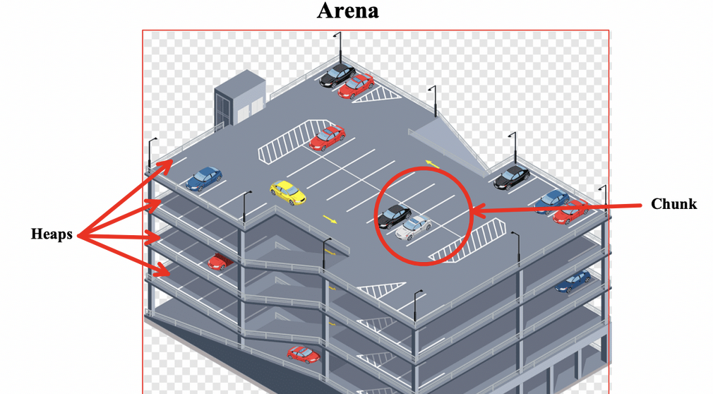

# Thread Cache (Tcache)

## Introduction

This is a new technology implemented in glibc version 2.27 that is designed to boost performance and make heap management more efficient.&#x20;

More specifically, it is a per-thread memory allocation cache that is meant to improve the performance of `malloc()` and `free()` operations that are occurring within a given program.&#x20;

This works by reducing overhead and contention on global memory allocation structures (such as the main arena -- example pictured below). This is possible because these ultra-small, per-thread caches of freed memory blocks remain maintained throughout execution and can be reused very quickly.&#x20;

### Remembering how it works is very simple

<mark style="color:yellow;">For each chunk size</mark> (max = `0x410`), will get its own, dedicated, <mark style="color:yellow;">tcache</mark> bin. This can store up to <mark style="color:yellow;">seven chunks</mark>.

<figure><figcaption><p>Great heap illustration -- parking lot</p></figcaption></figure>

When a specific size is allocated, the tcache bin will be the first thing searched. When it is freed (`free()`), the chunk is added to the tcache bin.

However, if it is full, it then goes to the standard fastbin/unsorted bin.&#x20;

## Tcache Example

`tcache.c`:

```c
#include <stdio.h>
#include <stdlib.h>

int main() {
    // Allocate memory
    char *ptr1 = (char *)malloc(32);
    char *ptr2 = (char *)malloc(32);

    // Use the allocated memory
    snprintf(ptr1, 32, "Hello, tcache!");
    snprintf(ptr2, 32, "Goodbye, tcache!");

    // Print ptr1 and ptr2 before freeing
    printf("Before freeing:\n");
    printf("ptr1: %s\n", ptr1);
    printf("ptr2: %s\n", ptr2);

    // Free the memory
    free(ptr1);
    free(ptr2);

    // Allocate again, reusing tcache
    char *ptr3 = (char *)malloc(32);
    char *ptr4 = (char *)malloc(32);

    // Use the reused memory
    snprintf(ptr3, 32, "Reused memory block!");
    snprintf(ptr4, 32, "Another reused block!");

    // Print the results
    printf("After reallocating:\n");
    printf("ptr3: %s\n", ptr3);
    printf("ptr4: %s\n", ptr4);

    // Free the memory
    free(ptr3);
    free(ptr4);

    return 0;
}
```

This code snippet will show how `malloc()` and `free()` interact with the tcache in C.

#### Explanation

1. <mark style="color:orange;">**Before Freeing**</mark>: The `printf` statements show the content of `pt1` and `ptr2` before they are freed. This confirms that they have been allocated and used.
2. <mark style="color:orange;">**Freeing Memory**</mark>: The `free(ptr1)` and `free(ptr2)` calls add these blocks to the tcache.
3. Reallocating Memory: When `ptr3` and `ptr4` are allocated, they reuse the memory blocks previously used by `ptr1` and `ptr2` due to the tcache mechanism.
4. After Reallocating: The `printf` statements show the contents of `ptr3` and `ptr4` which show that they have been reused and contain the new strings.&#x20;

Why all the `prints`? This is to show the contents of `ptr3` and `ptr4` which helps us visualize and observe the entire memory/data lifecycle; memory allocation, deallocation, and reuse process with the tcache.

#### Why did we use a mixture of `printf` and `snprintf` in the example?

This is for healthy/secure coding habits.&#x20;

`snprintf` is used to format a string and store it in a buffer. This is necessary because we want to place this formatted string into the allocated memory pointed to by the `ptr`'s.

`snprintf` also allows us to specify the size of the buffer; ensuring that we do not write more characters/data than our buffer an hold. This ultimately prevents buffer overflows.

`printf` was used to simply print formatted output directly to the console. Ultimately, to allow us to demonstrate reuse of memory blocks.

## Dynamically Viewing the Tcache via Debugger

> :rotating\_light: When debugging and working with heap memory it is important to keep mind of some things. For instance, you may run into `gdb` errors you have never seen before. This may be due to the heap not being initialized yet (A.K.A. nothing has been allocated to the heap yet).&#x20;

**Example:** Attempting to run `tcache` before the heap has been initialized.

<figure><figcaption><p><code>gdb</code> error from heap not being utilized yet</p></figcaption></figure>

Just something I want you guys to be aware of!

### Debugging Steps

When you see the pointers getting freed, their memory blocks will be added to the tcache. Since `ptr3` and `ptr4` are being reallocated with the same size, `malloc(32)`, we can store them in the same size class within the tcache.&#x20;

By visualizing this in a debugger, you will be able to see how tcache entries are managed and why they may reset back to zero or reuse previous entries!

Set a breakpoint on `main`: `b main`

Then, use `n` for next instruction.

At this point, you should be past the first `malloc` and our pointer (`char *` pointer), `ptr1`, is being allocated 32-bytes of data on the heap.&#x20;

<figure><figcaption></figcaption></figure>

<figure><figcaption></figcaption></figure>

Viewing the current state of the tcache contents. This data includes bins and their contents.

Continue stepping through the code with `n` until you get to the first `free`. After that, view the `tcache` once more.

<figure><figcaption><p>First <code>free</code></p></figcaption></figure>

We can then see that the entry, `0xaaaaaaab22a0`, has changed upon executing the second `free`.

<figure><figcaption><p>Second <code>free</code> <code>0xaaaaaaab22d0</code>,</p></figcaption></figure>

We can see that the contents of recently freed memory blocks are being reused during recent allocations:

<figure><figcaption><p>Same entry as our first memory allocation, <code>0xaaaaaaab22a0</code></p></figcaption></figure>

We can ultimately see that the tcache is working and boosting memory allocation efficiency and speeds by reusing blocks from the cache.&#x20;

<figure><figcaption><p>We can see the tcache state resets to zero because the cache block becomes reallocated and the bcache bins for that class size becomes empty.</p></figcaption></figure>

**Visualizing this:**

```
1.	Initial Allocations:
•	ptr1 = malloc(32); -> Allocated memory from the heap.
•	ptr2 = malloc(32); -> Allocated memory from the heap.
2.	Initial Freeing:
•	free(ptr1); -> Adds block to tcache.
•	free(ptr2); -> Adds block to tcache.
3.	Reallocation:
•	ptr3 = malloc(32); -> Reuses block from tcache.
•	ptr4 = malloc(32); -> Reuses block from tcache.
4.	Second Freeing:
•	free(ptr3); -> Adds block to tcache.
•	free(ptr4); -> Adds block to tcache.
5.	Third snprintf:
•	If the third snprintf involves a malloc that reuses the tcache entries:
•	malloc(32); -> Reuses the first cached block.
•	malloc(32); -> Reuses the second cached block.
•	Now, the tcache entries for that size class are zero.
```

#### Let's keep going deeper!

<figure><figcaption><p>We can see that <code>22d0</code> gets used once more and a block gets added to the tcache.</p></figcaption></figure>

After the fourth `free`, we see that `22a0` gets used once more as another block gets added to the tcache.

<figure><figcaption></figcaption></figure>

## Short Comings of The Tcache

Unfortunately, although the Tcache introduces major performance improvements, it also introduces new attack surfaces for memory corruption bugs.

**The bugs include:**

* <mark style="color:red;">**Tcache Poisoning**</mark>: An attacker can manipulate the tcache bins to create arbitrary write primitives, potentially leading to code execution.
* <mark style="color:red;">**Use-After-Free (UAF)**</mark>: UAF bugs will actually become easier because freed blocks will still be accessible in the tcache since it will act like a fastbin -- a singly-linked list of freed chunks of a specific size. The handling of the list using file descriptor (`fd`) pointers, is the same, meaning, that you can utilize the same attacks on the tcache that you can on fastbins.&#x20;

### Mitigations

* Pointer Authentication Code (PAC)
* Bounds Checking
* Randomization (PIE + ASLR)
