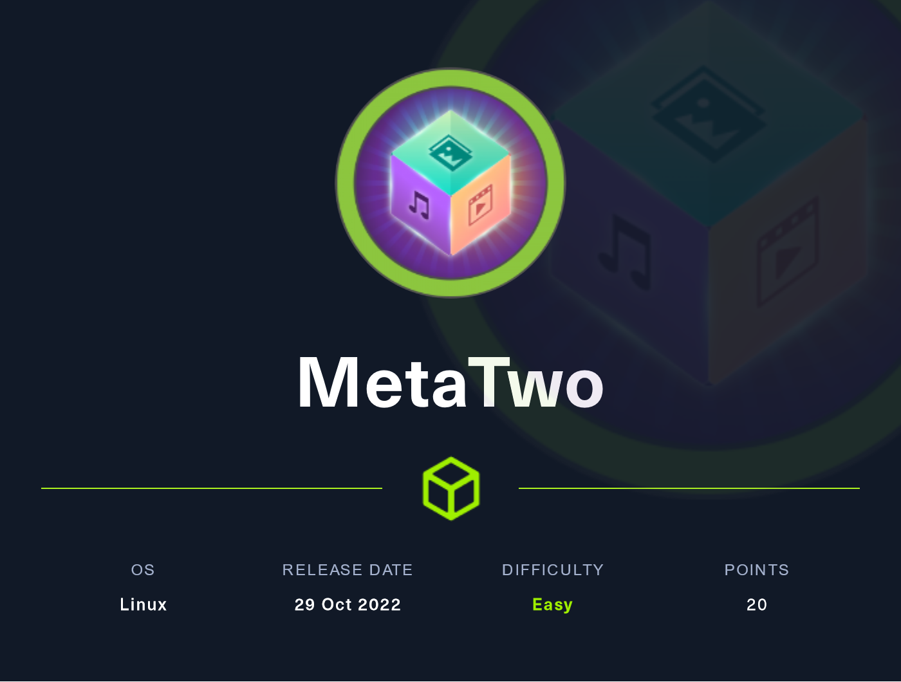

# MetaTwo (Easy)

<figure><figcaption></figcaption></figure>

## Information Gathering

Scanned all TCP ports:

```
```

Enumerated UDP ports:

```
```

Notes:

* Port 21 is open
* Port 22 is open
* Port 80 is open
  * Upon visiting metapress.htb, I could not connect to the site because the URL says metapress.htb
  * Let's add this to the /etc/hosts file

## Enumeration

### Port 80 - HTTP (Nginx 1.18.0) CMS: Wordpress 5.6.2

#### Visual Inspection

<figure><figcaption><p>Root page</p></figcaption></figure>

Upon clicking on search, we see a PHP parameter pop up in the URL. Is it possible to inject here?


<figure><figcaption><p>Can we inject here?</p></figcaption></figure>

## Exploitation

### Name of the technique

This is the exploit

## Privilege Escalation

### Local enumeration

### PrivEsc vector

## Proofs
