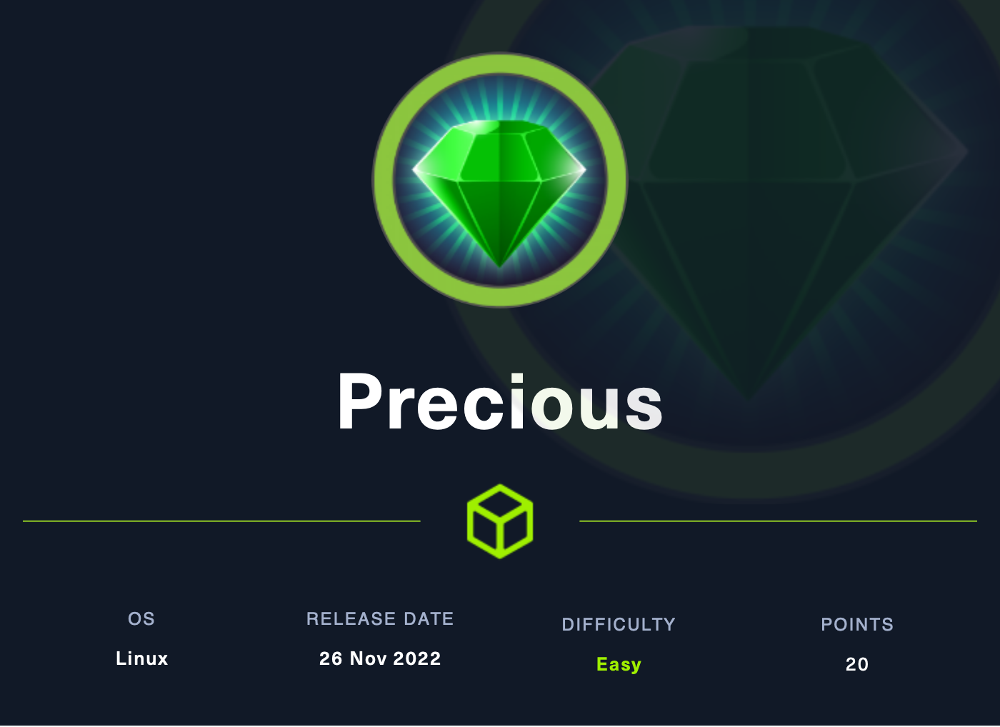

# Precious (Easy)

<figure><figcaption></figcaption></figure>

## Information Gathering

Scanned all TCP ports:

```
PORT   STATE SERVICE VERSION
22/tcp open  ssh     OpenSSH 8.4p1 Debian 5+deb11u1 (protocol 2.0)
| ssh-hostkey: 
|   3072 845e13a8e31e20661d235550f63047d2 (RSA)
|   256 a2ef7b9665ce4161c467ee4e96c7c892 (ECDSA)
|_  256 33053dcd7ab798458239e7ae3c91a658 (ED25519)
80/tcp open  http    nginx 1.18.0
|_http-title: Did not follow redirect to http://precious.htb/
|_http-server-header: nginx/1.18.0
| http-methods: 
|_  Supported Methods: GET HEAD POST OPTIONS
Service Info: OS: Linux; CPE: cpe:/o:linux:linux_kernel
```

Enumerated UDP ports:

```
```

Notes:

The IP address immediately takes us to an unable to load page, but we notice precious.htb at the top.&#x20;

Let's add this to host to /etc/hosts so we can navigate to this site.

## Enumeration

### Port 80 - HTTP (nginx 1.18.0)

site->2->PDF website?

<figure><figcaption></figcaption></figure>

* Ran a directory bruteforce utilizing 'dirsearch' with no luck
* Started a local HTTP server and attempted to communicate with my server within the webapp and I was not able to communicate backwards
* So, I naturally started up Burpsuite to see the request

<figure><figcaption></figcaption></figure>

* Still nothing too interesting... let's check out the web app's code

```
```

## Exploitation

### Name of the technique

This is the exploit
