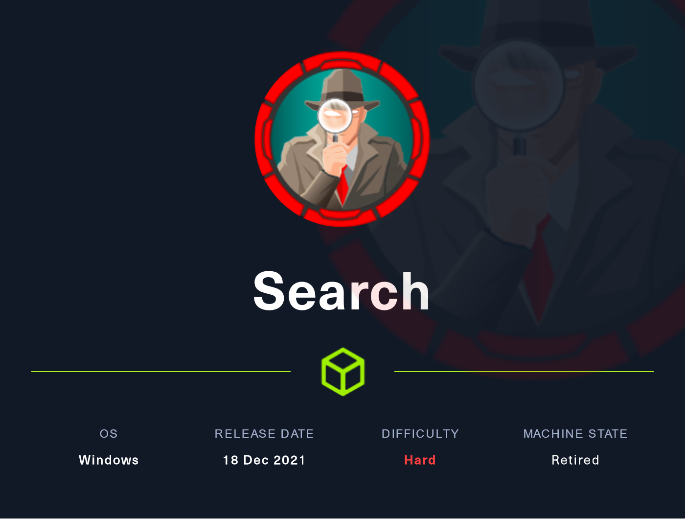

# Search (Hard)

<figure><figcaption></figcaption></figure>

## Information Gathering

Scanned all TCP ports:

```
# Nmap 7.93 scan initiated Sun Nov  6 10:47:32 2022 as: nmap -sV -sC -v -p- -oN Search_TCP 10.129.227.156
Nmap scan report for 10.129.227.156
Host is up (0.035s latency).
Not shown: 65514 filtered tcp ports (no-response)
PORT      STATE SERVICE       VERSION
53/tcp    open  domain        Simple DNS Plus
80/tcp    open  http          Microsoft IIS httpd 10.0
|_http-title: Search &mdash; Just Testing IIS
|_http-server-header: Microsoft-IIS/10.0
| http-methods: 
|   Supported Methods: OPTIONS TRACE GET HEAD POST
|_  Potentially risky methods: TRACE
88/tcp    open  kerberos-sec  Microsoft Windows Kerberos (server time: 2022-11-06 15:49:25Z)
135/tcp   open  msrpc         Microsoft Windows RPC
139/tcp   open  netbios-ssn   Microsoft Windows netbios-ssn
389/tcp   open  ldap          Microsoft Windows Active Directory LDAP (Domain: search.htb0., Site: Default-First-Site-Name)
|_ssl-date: 2022-11-06T15:50:54+00:00; 0s from scanner time.
| ssl-cert: Subject: commonName=research
| Issuer: commonName=search-RESEARCH-CA
| Public Key type: rsa
| Public Key bits: 2048
| Signature Algorithm: sha256WithRSAEncryption
| Not valid before: 2020-08-11T08:13:35
| Not valid after:  2030-08-09T08:13:35
| MD5:   0738614f7bc029d06d1d9ea63cdbd99e
|_SHA-1: 10ae549429d61e44276fb8a224cafde9de93af78
443/tcp   open  ssl/http      Microsoft IIS httpd 10.0
| http-methods: 
|   Supported Methods: OPTIONS TRACE GET HEAD POST
|_  Potentially risky methods: TRACE
|_ssl-date: 2022-11-06T15:50:54+00:00; +1s from scanner time.
| tls-alpn: 
|_  http/1.1
| ssl-cert: Subject: commonName=research
| Issuer: commonName=search-RESEARCH-CA
| Public Key type: rsa
| Public Key bits: 2048
| Signature Algorithm: sha256WithRSAEncryption
| Not valid before: 2020-08-11T08:13:35
| Not valid after:  2030-08-09T08:13:35
| MD5:   0738614f7bc029d06d1d9ea63cdbd99e
|_SHA-1: 10ae549429d61e44276fb8a224cafde9de93af78
|_http-title: Search &mdash; Just Testing IIS
445/tcp   open  microsoft-ds?
464/tcp   open  kpasswd5?
593/tcp   open  ncacn_http    Microsoft Windows RPC over HTTP 1.0
636/tcp   open  ssl/ldap      Microsoft Windows Active Directory LDAP (Domain: search.htb0., Site: Default-First-Site-Name)
|_ssl-date: 2022-11-06T15:50:54+00:00; +1s from scanner time.
| ssl-cert: Subject: commonName=research
| Issuer: commonName=search-RESEARCH-CA
| Public Key type: rsa
| Public Key bits: 2048
| Signature Algorithm: sha256WithRSAEncryption
| Not valid before: 2020-08-11T08:13:35
| Not valid after:  2030-08-09T08:13:35
| MD5:   0738614f7bc029d06d1d9ea63cdbd99e
|_SHA-1: 10ae549429d61e44276fb8a224cafde9de93af78
3268/tcp  open  ldap          Microsoft Windows Active Directory LDAP (Domain: search.htb0., Site: Default-First-Site-Name)
|_ssl-date: 2022-11-06T15:50:54+00:00; 0s from scanner time.
| ssl-cert: Subject: commonName=research
| Issuer: commonName=search-RESEARCH-CA
| Public Key type: rsa
| Public Key bits: 2048
| Signature Algorithm: sha256WithRSAEncryption
| Not valid before: 2020-08-11T08:13:35
| Not valid after:  2030-08-09T08:13:35
| MD5:   0738614f7bc029d06d1d9ea63cdbd99e
|_SHA-1: 10ae549429d61e44276fb8a224cafde9de93af78
3269/tcp  open  ssl/ldap      Microsoft Windows Active Directory LDAP (Domain: search.htb0., Site: Default-First-Site-Name)
| ssl-cert: Subject: commonName=research
| Issuer: commonName=search-RESEARCH-CA
| Public Key type: rsa
| Public Key bits: 2048
| Signature Algorithm: sha256WithRSAEncryption
| Not valid before: 2020-08-11T08:13:35
| Not valid after:  2030-08-09T08:13:35
| MD5:   0738614f7bc029d06d1d9ea63cdbd99e
|_SHA-1: 10ae549429d61e44276fb8a224cafde9de93af78
|_ssl-date: 2022-11-06T15:50:57+00:00; 0s from scanner time.
8172/tcp  open  ssl/http      Microsoft IIS httpd 10.0
|_ssl-date: 2022-11-06T15:50:54+00:00; +1s from scanner time.
|_http-title: Site doesn't have a title.
|_http-server-header: Microsoft-IIS/10.0
| ssl-cert: Subject: commonName=WMSvc-SHA2-RESEARCH
| Issuer: commonName=WMSvc-SHA2-RESEARCH
| Public Key type: rsa
| Public Key bits: 2048
| Signature Algorithm: sha256WithRSAEncryption
| Not valid before: 2020-04-07T09:05:25
| Not valid after:  2030-04-05T09:05:25
| MD5:   eeb9303e6d46bd8b34a01ed60eb83287
|_SHA-1: 1e069fd0ef45b05178b2c6bf1bed975ea87d0458
| tls-alpn: 
|_  http/1.1
9389/tcp  open  mc-nmf        .NET Message Framing
49667/tcp open  msrpc         Microsoft Windows RPC
49693/tcp open  ncacn_http    Microsoft Windows RPC over HTTP 1.0
49694/tcp open  msrpc         Microsoft Windows RPC
49710/tcp open  msrpc         Microsoft Windows RPC
49721/tcp open  msrpc         Microsoft Windows RPC
49733/tcp open  msrpc         Microsoft Windows RPC
Service Info: Host: RESEARCH; OS: Windows; CPE: cpe:/o:microsoft:windows

Host script results:
| smb2-time: 
|   date: 2022-11-06T15:50:18
|_  start_date: N/A
| smb2-security-mode: 
|   311: 
|_    Message signing enabled and required

Read data files from: /usr/bin/../share/nmap
Service detection performed. Please report any incorrect results at https://nmap.org/submit/ .
# Nmap done at Sun Nov  6 10:51:01 2022 -- 1 IP address (1 host up) scanned in 208.97 seconds

```

Enumerated UDP ports:

```
PORT    STATE SERVICE
53/udp  open  domain
123/udp open  ntp
```

Notes:

* 53/DNS -- <mark style="color:yellow;">search.htb</mark> (added to /etc/hosts)
* 88/HTTP -- IIS server&#x20;
  * List of users
  *

## Enumeration

### Port 80 - HTTP (Apache)

random text here

## Exploitation

### Name of the technique

This is the exploit

## Privilege Escalation

### Local enumeration

### PrivEsc vector
