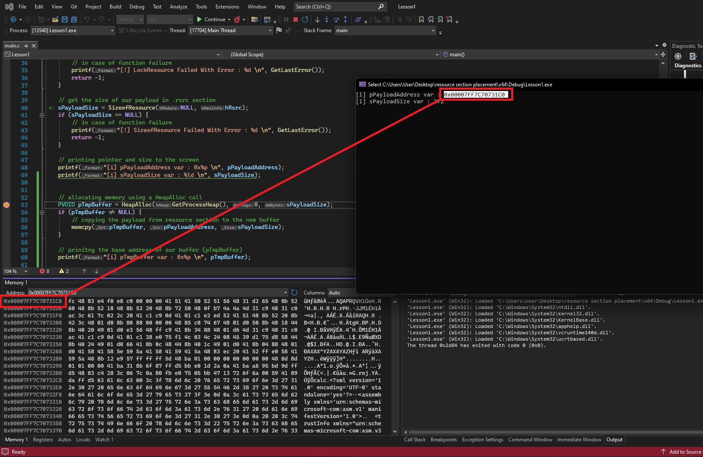
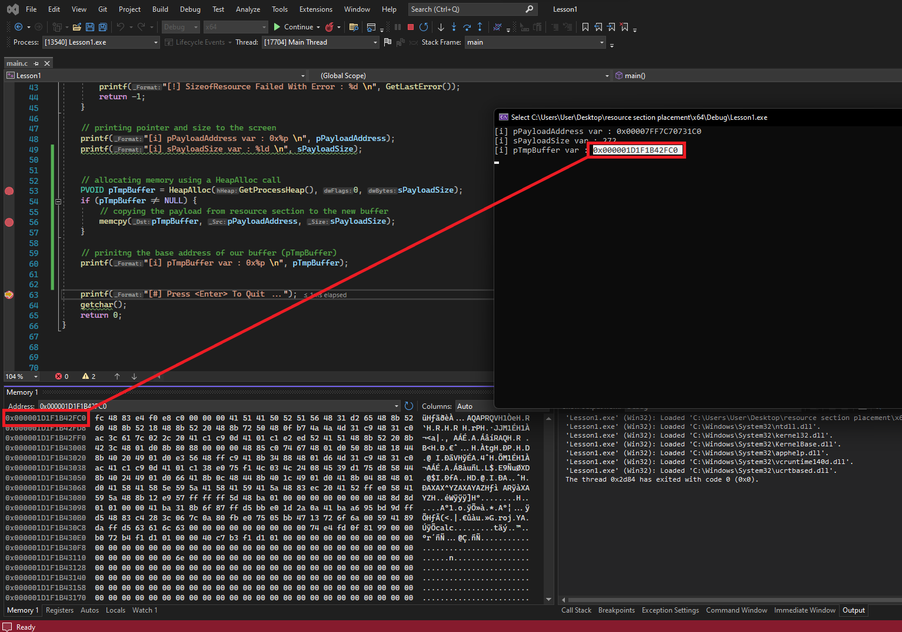

# Payload Placement

## Motivation

There are several different locations where you can embed a payload within a Portable Executable (PE) file. Depending on your choice, it will reside within a different "section" within it. Payloads can be stored within the following PE sections:

* `.data`
* `.rdata`
* `.text`
* `.rsrc`
* _**Custom**_ (this can be a custom header/section that is added to a PE to store your shellcode or payload and can be done so using a tool like [PE-Bear](https://github.com/hasherezade/pe-bear))

### `.data` Section

The `.data` section of a PE file contains global and static variables declared within the source code. Once compiled (depending on compiler settings) into a PE binary, they are all conveniently stored within this dedicated section.&#x20;

#### Benefits

:white\_check\_mark: Since this section of the PE file is readable and writable (RW), it makes it a great place to store an encrypted payload that requires decryption during runtime.&#x20;

**Example:**

```cpp
unsigned char shellcode[] = {
 <shellcode_here>
}
```

Since we are storing our shellcode in a variable-declared buffer (`[ ]`), this is going to be stored in the `.data` section.

### `.rdata` Section

Variables specified using const are written as constants. These are considered read-only data, hence the r in .rdata. Any attempt to change these variables will lead to access violations.&#x20;

```cpp
const unsigned char shellcode[] = {
 <shellcode_here>
}
```

### `.text` Section

Unlike just declaring a variable like above, a programmer must tell the compiler to save the variable within the `.text` section.&#x20;

Below, the compiler is told to place variable in the `.text` section instead of the `.rdata` section.

```cpp
#pragma section(".text")
__declspec(allocate(".text")) const unsigned char shellcode[] = {
 <shellcode_here>
}
```

In this section, variables are stored with executable memory permissions. Meaning that they are allowed to be executed directly without the need for editing the memory region permissions. This is useful for small payloads that are very small (less than 10 bytes).


Using a tool like PE-Bear, we can examine our payload is stored within the `.text` region.


### `.rsrc` Section

Storing payloads within the `.rsrc` section is a cleaner method for malware authors for a few reasons. Primarily, larger payloads cannot be stored in the `.data` or `.rdata` sections due to size limits which lead to painful compilation errors.

### Viewing Variables and Payloads in Raw Binary Format

We can use tools like `dumpbin.exe` and x86/x64dbg in order to view our payload in memory.

### `.rsrc` Section

By saving payloads within the `.rsrc` section, we can implement larger payloads collectively throughout our malware development journey.

#### How-To

1. Inside of Visual Studio, right-click on "Resource Files" -> "Add" -> "New Item"
2. Click on "Resource File"
3. It will then generate a new sidebar, known as the "Resource View". Right-click on the `.rc` file and select the "Add Resource" option
4. Click "Import"
5. EXAMPLE: Select the `calc.ico` file, which is the raw payload renamed to have the `.ico` extension
6. A prompt will appear requesting the resource type. Enter "RCDATA" without quotes
7. After clicking "OK", the payload should be displayed in raw binary format within the VS project
8. When exiting the "Resource View", the `resource.h` header file should be visible and named according to the `.rc` file from step 2. This file will contain a `define` statement that refers to the payload's ID in the resource section (`LDR_RCDATA1`). This is important in order to be able to retrieve the payload from the resource section later

<figure><figcaption></figcaption></figure>

Once compiled, the payload will now be stored within the `.rsrc` section. However, keep in mind that it cannot be accessed directly. Instead, several WinAPIs must be used to access it.

**Those being:**

1. `FindResourceW()` - Obtain the location of the specified data stored in the resource section of a special ID passed in (defined in header file).
2. `LoadResource()` - Retrieves an `HGLOBAL` handle of the resource data. This handle can then be used to obtain the base address of the specified resource in memory.&#x20;
3. `LockResource()` - Obtain a pointer to the specified data in the resource section from its handle.
4. `SizeOfResource()` - Obtain size of the specified data in the resource section.

### Windows API Code Snippet to Access the `.rsrc` Section

This will fetch the payload address and size using the Windows API.

```cpp
#include <Windows.h>
#include <stdio.h>
#include "resource.h"

int main() {

	HRSRC		hRsrc                   = NULL;
	HGLOBAL		hGlobal                 = NULL;
	PVOID		pPayloadAddress         = NULL;
	SIZE_T		sPayloadSize            = NULL;

	
	// Get the location to the data stored in .rsrc by its id *IDR_RCDATA1*
	hRsrc = FindResourceW(NULL, MAKEINTRESOURCEW(IDR_RCDATA1), RT_RCDATA);
	if (hRsrc == NULL) {
		// in case of function failure 
		printf("[!] FindResourceW Failed With Error : %d \n", GetLastError());
		return -1;
	}

	// Get HGLOBAL, or the handle of the specified resource data since its required to call LockResource later
	hGlobal = LoadResource(NULL, hRsrc);
	if (hGlobal == NULL) {
		// in case of function failure 
		printf("[!] LoadResource Failed With Error : %d \n", GetLastError());
		return -1;
	}

	// Get the address of our payload in .rsrc section
	pPayloadAddress = LockResource(hGlobal);
	if (pPayloadAddress == NULL) {
		// in case of function failure 
		printf("[!] LockResource Failed With Error : %d \n", GetLastError());
		return -1;
	}

	// Get the size of our payload in .rsrc section
	sPayloadSize = SizeofResource(NULL, hRsrc);
	if (sPayloadSize == NULL) {
		// in case of function failure 
		printf("[!] SizeofResource Failed With Error : %d \n", GetLastError());
		return -1;
	}
	
	// Printing pointer and size to the screen
	printf("[i] pPayloadAddress var : 0x%p \n", pPayloadAddress);
	printf("[i] sPayloadSize var : %ld \n", sPayloadSize);
	printf("[#] Press <Enter> To Quit ...");
	getchar();
	return 0;
}
```

In this PoC, the payload address along with its size will be printed onto the screen. It is important to understand that this address is in the `.rsrc` section, is read-only memory.&#x20;

This means that any/all attempts to change or edit the data within it will cause an access violation error.

In order to edit the payload, a buffer must be allocated with the same size as the payload and copied over. This new buffer is where changes such as decrypting the payload can be made.&#x20;

### Okay, so how do we update the `.rsrc` payload?

In order to do so since we cannot edit it directly within the resource section, it must be moved to a temporary buffer. In order to do so, memory is allocated to the size of the payload using the `HeapAlloc` function and then the payload is moved from the resource section to the temporary buffer using `memcpy()`.&#x20;

```cpp
// Allocating memory using a HeapAlloc call
PVOID pTmpBuffer = HeapAlloc(GetProcessHeap(), 0, sPayloadSize);
if (pTmpBuffer != NULL){
	// copying the payload from resource section to the new buffer 
	memcpy(pTmpBuffer, pPayloadAddress, sPayloadSize);
}

// Printing the base address of our buffer (pTmpBuffer)
printf("[i] pTmpBuffer var : 0x%p \n", pTmpBuffer);
```

Since `pTmpBuffer` now points to a writable memory region that is holding the payload, it's possible to decrypt the payload or perform and updates to it.

The image below shows the Msfvenom shellcode stored within the resource (`.rsrc`) section.&#x20;

<figure><figcaption></figcaption></figure>

We can then later see that the payload has been saved in the temporary buffer.

<figure><figcaption></figcaption></figure>
