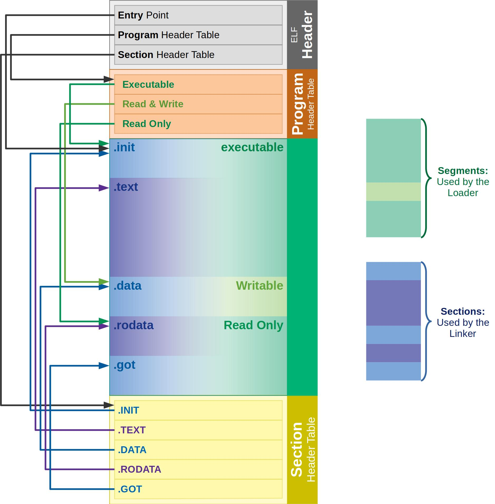

# Binary Exploitation with Python

## Executable and Linkable Format (ELF)

## Pyelftools Library

* The motivation behind this is to understand how an ELF file works and why it is the way it is

There is a great article on this file format that can be found here:&#x20;



### Visual Depiction of the ELF file format

<figure><figcaption></figcaption></figure>

* One important piece of binary exploitation is grabbing the data (code) portion of the program
* This can be accomplished a few different ways, but I wanted to showcase a quick Python solution

## Utilizing Python

```
f = None
with open('binary_name_here'), 'rb') as fh:
    f =fh. read()
    
    
    eh = f[52:]
    eh
    
so = eh[32:36]
so = int.from_bytes(so, byteorder='little')
so
```

* Note that byteorder is a command arg and can either be 'little' or 'big'
