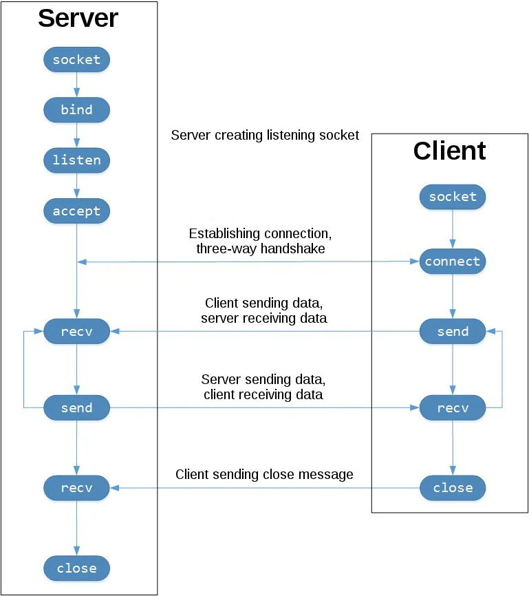

# Socket Code

## Sockets

This technology provides a way to send messages across a network.

This works via sockets and the socket API.

The most common type of socket applications are client-server applications, where one side acts as the server and the other waits for connections from clients.

## Socket API Overview

<mark style="color:yellow;">The primary socket API functions and methods in this module are</mark>:&#x20;

* socket()
* .bind()
* .listen()
* .accept()
* .connect()
* .connect\_ex()
* .send()
* .recv()
* .close()

## TCP Sockets

<mark style="color:yellow;">You can create a socket object using socket.socket(), specifying the socket type as socket.SOCK\_STREAM</mark>. When you do that, the default protocol that's used is the <mark style="color:yellow;">TCP Protocol</mark>.&#x20;

## UDP Sockets

UDP Sockets can be created with socket.SOCK\_DGRAM are NOT reliable, and data read by the receiver can be out-of-order from the sender's writes.

<figure><figcaption></figcaption></figure>

## API Calls that the server makes up a "listening" socket:

* socket()
* .bind()
* .listen()
* .accept()

### How does it work?

A listening socket does exactly what its name suggests. It listens for connections from clients. When a client connects, the server calls .accept() to accept or complete the connection.

The client calls .connect() to establish a connection to the server and initiate the three-way handshake. The handshake step is important because it ensures that each side of the connection is reachable in the network.

<mark style="color:yellow;">In the middle is the round-trip section</mark>. This is where data is exchanged between the client and server using calls to .send() and .recv().

At the bottom, the client and server close their respective sockets.

## Echo Client and Server

<mark style="color:yellow;">This little program will simply echo whatever it receives back to the client.</mark>

### Server

```python
# echo-server.py

import socket

HOST = "127.0.0.1" 
PORT = 65432

with socket.socket(socket.AF_INET, socket.SOCK_STREAM) as s:
    s.bind((HOST, PORT))
    s.listen()
    conn, addr = s.accept()
    with conn:
        print(f"Connected by {addr}")
        white True:
            data = conn.recv(1024)
            if not data:
                break
            conn.sendall(data)
```

What is happening in the API call?

<mark style="color:green;">socket.socket()</mark> <mark style="color:yellow;">creates a socket object that supports the context manager type, so you can use it in a with statement</mark>. There is no need to call s.close():

* AF\_INET(IPv4) means that it expects a two-tuple a.k.a. (host, port).
* Host can be a hostname, IP, or empty string. IPv4 should be used. Port must be 1-65535.
* The .accept() method blocks execution and waits for an incoming connection. When a client connects, it returns a new socket object representing the connection and a tuple holding the address of the client. The tuple will contain the (host, port) for IPv4 connections or (host, port, flowinfo, scopeid) for IPv6.
* IMPORTANT: You now have a new socket object from .accept(). This is important because it's the socket that you'll use to communicate with the client. It's distinct from the listening socket that the server is using to accept new connections.
* After .accept() provides the client socket object conn, an infinite while loop is being used to loop over blocking calls to conn.recv(). This reads whatever data the client sends and echoes back using conn.sendall().
* If conn.recv() returns an empty bytes object, b' ', that signals that the client closed the connection and the loop is terminated. The with statement is used with conn to automatically close the socket at the end of the block.

### Client

```
# echo-client.py

import socket

HOST
```
